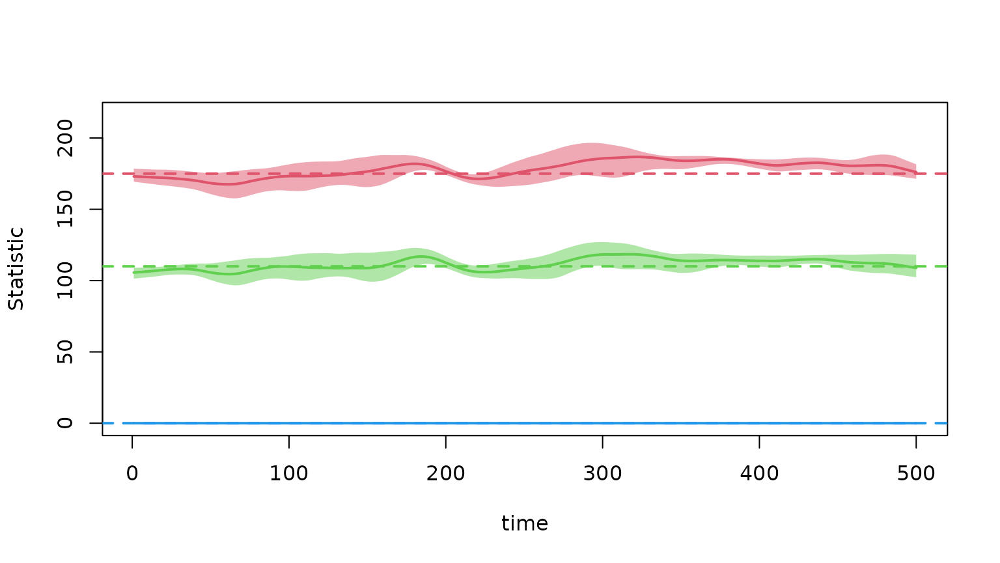
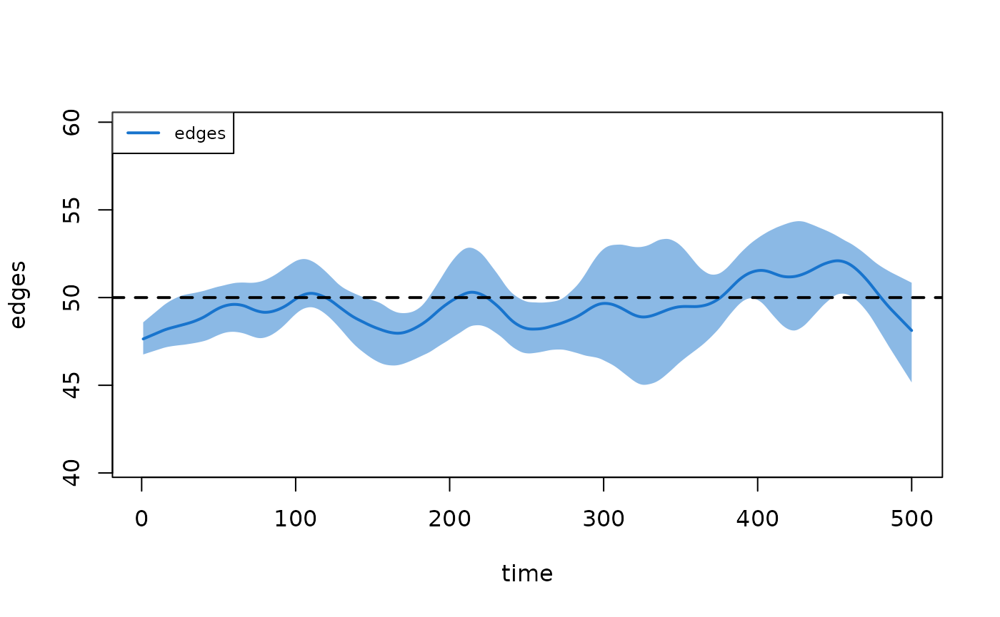
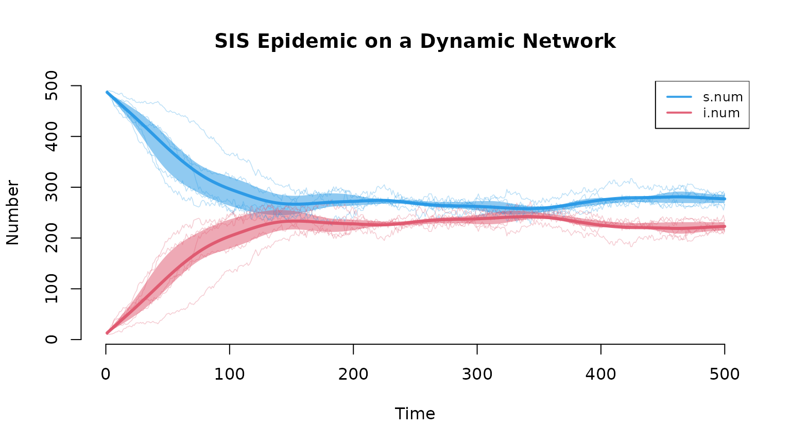
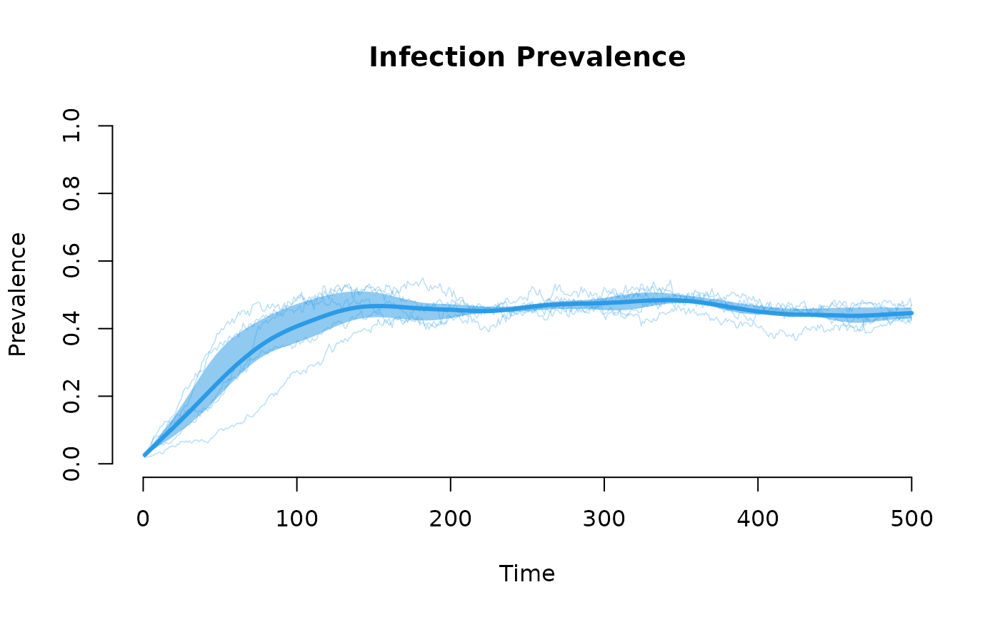

# EpiModel: Mathematical Modeling of Infectious Disease Dynamics

## What EpiModel Does

The **EpiModel** package provides tools for simulating mathematical
models of infectious disease dynamics. It supports three model classes:

- **Deterministic Compartmental Models (DCMs):** ODE-based,
  population-level models for rapid exploration of epidemic dynamics
  under simplifying assumptions.
- **Stochastic Individual-Contact Models (ICMs):** Agent-based models
  with random mixing and stochastic variability.
- **Stochastic Network Models:** The primary focus of EpiModel. These
  use exponential-family random graph models (ERGMs) from the Statnet
  suite to represent dynamic contact networks where partnerships form,
  persist, and dissolve according to statistically estimated rules.
  Network models capture features that strongly influence transmission
  dynamics—degree distributions, partnership durations, concurrency,
  assortative mixing, and clustering.

All three model classes share a unified API: configure inputs with
`param.*()`, `init.*()`, and `control.*()`, then run simulations with
[`dcm()`](https://epimodel.github.io/EpiModel/reference/dcm.md),
[`icm()`](https://epimodel.github.io/EpiModel/reference/icm.md), or
[`netsim()`](https://epimodel.github.io/EpiModel/reference/netsim.md).

This vignette walks through the full network model pipeline, from
network estimation through epidemic simulation and analysis.

## The Network Model Pipeline

### Step 1: Network Estimation

Network models begin with specifying and estimating the contact network.
We define a network of 500 people, then estimate an ERGM that produces
networks with a target mean degree of 0.7 (175 edges), limited
concurrency (no more than 110 nodes with 2+ partners), and no one with
4+ partners. Partnerships last an average of 50 time steps.

``` r

library(EpiModel)
set.seed(12345)

nw <- network_initialize(n = 500)

formation <- ~edges + concurrent + degrange(from = 4)
target.stats <- c(175, 110, 0)
coef.diss <- dissolution_coefs(
  dissolution = ~offset(edges),
  duration = 50   # mean partnership duration in time steps
)

est <- netest(nw, formation, target.stats, coef.diss, verbose = FALSE)
```

    ## Warning: 'glpk' selected as the solver, but package 'Rglpk' is not available;
    ## falling back to 'lpSolveAPI'. This should be fine unless the sample size and/or
    ## the number of parameters is very big.

### Step 2: Network Diagnostics

Before using the estimated network in an epidemic model, we diagnose the
fit. `netdx` simulates dynamic networks from the fitted model and
compares summary statistics against targets. This is a critical
validation step.

``` r

dx <- netdx(est, nsims = 5, nsteps = 500, verbose = FALSE)
```

The formation diagnostic shows how well the simulated networks maintain
the target statistics (dashed lines) over time. The mean across
simulations (solid line) and the interquartile range (shaded band)
should track the targets closely:

``` r

plot(dx)
```



The duration diagnostic confirms that partnership durations match the
specified target of 50 time steps:

``` r

plot(dx, type = "duration")
```



### Step 3: Epidemic Simulation

With a validated network model, we layer on the epidemic. This SIS model
uses a per-act transmission probability of 0.4, 2 acts per partnership
per time step, and a recovery rate of 0.05. We seed 10 infections and
run 5 stochastic simulations for 500 time steps.

``` r

param <- param.net(inf.prob = 0.4, act.rate = 2, rec.rate = 0.05)
init <- init.net(i.num = 10)
control <- control.net(type = "SIS", nsims = 5, nsteps = 500, verbose = FALSE)

sim <- netsim(est, param, init, control)
```

### Step 4: Analyzing Results

#### Epidemic Trajectories

The default plot shows compartment sizes over time, with the mean across
simulations (solid line), individual simulation traces, and a shaded
interquartile range capturing stochastic variability:

``` r

plot(sim, sim.lines = TRUE, sim.alpha = 0.3,
     mean.lwd = 3, qnts = 0.5, main = "SIS Epidemic on a Dynamic Network")
```



For prevalence (proportions rather than counts), use `popfrac = TRUE`:

``` r

plot(sim, y = "i.num", popfrac = TRUE, sim.lines = TRUE, sim.alpha = 0.3,
     mean.lwd = 3, qnts = 0.5, main = "Infection Prevalence",
     ylab = "Prevalence", legend = FALSE)
```



#### Summary Statistics

`summary` reports means, standard deviations, and proportions across
simulations at a specified time step:

``` r

summary(sim, at = 500)
```

    ## 
    ## EpiModel Summary
    ## =======================
    ## Model class: netsim
    ## 
    ## Simulation Details
    ## -----------------------
    ## Model type: SIS
    ## No. simulations: 5
    ## No. time steps: 500
    ## No. NW groups: 1
    ## 
    ## Model Statistics
    ## ------------------------------
    ## Time: 500 
    ## ------------------------------ 
    ##            mean      sd    pct
    ## Suscept.  277.6  11.194  0.555
    ## Infect.   222.4  11.194  0.445
    ## Total     500.0   0.000  1.000
    ## S -> I     11.8   3.564     NA
    ## I -> S     13.8   4.970     NA
    ## ------------------------------

#### Data Extraction

All epidemic data can be extracted as a `data.frame` for custom
analysis—per-simulation values, means, or standard deviations across
simulations:

``` r

d <- as.data.frame(sim)
head(d)
```

    ##   sim time s.num i.num num si.flow is.flow
    ## 1   1    1   490    10 500      NA      NA
    ## 2   1    2   484    16 500       6       0
    ## 3   1    3   481    19 500       4       1
    ## 4   1    4   480    20 500       2       1
    ## 5   1    5   479    21 500       5       4
    ## 6   1    6   472    28 500       7       0

#### Transmission Trees

The transmission matrix records every infection event: who infected
whom, when, and with what probability. This can be converted into a
phylogenetic tree to visualize chains of transmission.

``` r

# Run a separate SI model seeded with a single infection for a cleaner tree
set.seed(42)
param2 <- param.net(inf.prob = 0.5, act.rate = 2)
init2 <- init.net(i.num = 5)
control2 <- control.net(type = "SI", nsims = 1, nsteps = 60, verbose = FALSE)
sim2 <- netsim(est, param2, init2, control2)

tm <- get_transmat(sim2)
head(tm)
```

    ## # A tibble: 6 × 8
    ## # Groups:   at, sus [6]
    ##      at   sus   inf network infDur transProb actRate finalProb
    ##   <int> <int> <int>   <int>  <dbl>     <dbl>   <dbl>     <dbl>
    ## 1     2   100    55       1     22       0.5       2      0.75
    ## 2     2   500    55       1     22       0.5       2      0.75
    ## 3     3   141   462       1     44       0.5       2      0.75
    ## 4     4   175   141       1      1       0.5       2      0.75
    ## 5     5   223   418       1      5       0.5       2      0.75
    ## 6    16   414   418       1     16       0.5       2      0.75

``` r

tmPhylo <- as.phylo.transmat(tm)
```

    ## found multiple trees, returning a list of 3phylo objects

``` r

par(mar = c(2, 1, 2, 1))
plot(tmPhylo, show.node.label = TRUE, root.edge = TRUE, cex = 0.5,
     main = "Transmission Tree")
```


Each tip is an infected person; each internal node (labeled with the
infector’s ID) is a transmission event. The horizontal axis shows time,
revealing when and how the epidemic branched through the network.

## Extending EpiModel

The built-in SI, SIR, and SIS models are starting points. EpiModel’s
extension API allows you to define custom models with arbitrary disease
states, demographics, interventions, and feedback between the epidemic
and the network. A custom module is simply a function that takes the
simulation state (`dat`) and current time step (`at`), modifies state,
and returns it:

``` r

# Example: a custom progression module for an SEIR model
progress_module <- function(dat, at) {
  active <- get_attr(dat, "active")
  status <- get_attr(dat, "status")

  # E -> I transition
  ids.EtoI <- which(active == 1 & status == "e" & runif(length(status)) < 0.1)
  status[ids.EtoI] <- "i"

  # I -> R transition
  ids.ItoR <- which(active == 1 & status == "i" & runif(length(status)) < 0.02)
  status[ids.ItoR] <- "r"

  dat <- set_attr(dat, "status", status)
  dat <- set_epi(dat, "ei.flow", at, length(ids.EtoI))
  dat <- set_epi(dat, "ir.flow", at, length(ids.ItoR))
  return(dat)
}
```

Custom modules are passed to `control.net` and integrated into the
simulation loop. The [EpiModel
Gallery](https://epimodel.github.io/EpiModel-Gallery/) provides a
library of worked extension examples, and the advanced vignettes in this
package document the full API.

## Learning Pathway

We recommend the following tiered sequence for learning EpiModel,
consistent with the learning pathway on the [EpiModel
website](https://www.epimodel.org). This is oriented towards those
interested in stochastic network models, the primary focus of EpiModel.

### Beginner

- **Intro to EpiModel vignette:** This vignette and the full [package
  documentation](https://epimodel.github.io/EpiModel/) provide an
  overview of the three model classes and the unified API (core
  functions: `netest`, `netdx`, `netsim`).
- **JSS methods paper:** Our primary reference, published in the
  *Journal of Statistical Software*, provides the mathematical and
  computational foundations for all three model classes. See citation
  below.
- **NME Course, Section I (Chapters 3–35):** Lecture slides and
  tutorials covering network science, ERGM specification, model
  diagnostics, and built-in epidemic models
  (<https://epimodel.github.io/sismid/>).

### Intermediate

- **NME Course, Section II (Chapters 36–49):** [Extending
  EpiModel](https://epimodel.github.io/sismid/9_extending/mod9-Intro.html)
  materials covering the extension API for building custom models with
  novel disease states, demographics, and interventions.
- **EpiModel Gallery:** A library of worked extension model templates
  demonstrating custom disease states, demographics, interventions, and
  multi-layer networks (<https://epimodel.github.io/EpiModel-Gallery/>).

### Advanced

- **Package vignettes:** These vignettes within the package cover
  specific topics for users building custom network models with the
  extension API:
  - *Working with Model Parameters:* Scenarios for time-varying
    parameters, parameter input via tables, and random parameter
    distributions for sensitivity analysis.
  - *Working with Custom Attributes and Summary Statistics:* Nodal
    attributes, attribute histories, epidemic trackers, and custom
    summary statistics.
  - *Working with Network Objects:* Accessing and manipulating network
    objects, edgelists, cumulative edgelists, and reachability analysis
    within custom modules.
- **EpiModelHPC & slurmworkflow:** Tools for running large-scale
  simulations on high-performance computing clusters.
- **Template repositories:**
  [EpiModelHIV](https://github.com/EpiModel/EpiModelHIV-p) and
  [EpiModelCOVID](https://github.com/EpiModel/EpiModelCOVID) provide
  full-scale research model implementations.

## Package Documentation

The current version of EpiModel is v2.6.1. Within the package, consult
the help documentation for each exported function:

``` r

help(package = "EpiModel")
```

To see the latest updates, consult the `NEWS` file in the package or our
GitHub Releases (<https://github.com/EpiModel/EpiModel/releases>).

## Getting Help

Technical coding questions, conceptual modeling questions, and feature
requests may be posted as GitHub issues at our main repository
(<https://github.com/EpiModel/EpiModel/issues>).

## Citation

If using EpiModel for teaching or research, please include a citation to
our primary methods paper:

> Jenness SM, Goodreau SM and Morris M. EpiModel: An R Package for
> Mathematical Modeling of Infectious Disease over Networks. *Journal of
> Statistical Software.* 2018; 84(8): 1-47. doi: 10.18637/jss.v084.i08
> (<https://doi.org/10.18637/jss.v084.i08>).
