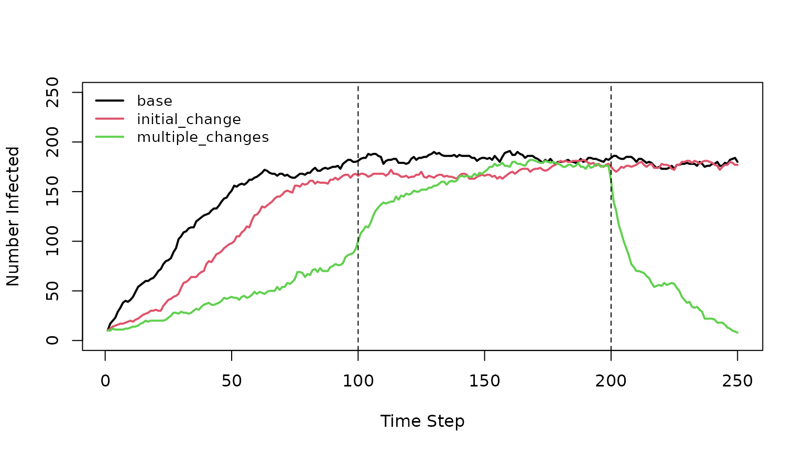
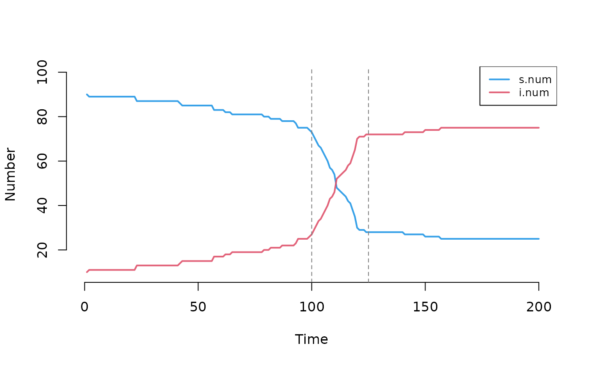

# Working with Model Parameters in EpiModel

## Introduction

This vignette assumes familiarity with setting up and running network
models in EpiModel. See the [Network Modeling for
Epidemics](https://epimodel.github.io/sismid/) (NME) course materials
and the [EpiModel Gallery](https://epimodel.github.io/EpiModel-Gallery/)
for background.

For working with nodal attributes and epidemic summary statistics, see
the companion vignette *Working with Custom Attributes and Summary
Statistics in EpiModel*. For network objects and edgelists, see *Working
with Network Objects in EpiModel*.

In a model, *parameters* are the input variables that define aspects of
system behavior. In a basic SIS (Susceptible-Infected-Susceptible)
model, these might include an **infection probability**, an **act
rate**, and a **recovery rate**. In simple models, each parameter is a
single fixed value that remains constant throughout a simulation.
Real-world applications, however, often require more flexibility:
parameters that change over time (e.g., to represent an intervention
rollout or behavioral change during an epidemic), parameters drawn from
distributions (for sensitivity analysis or calibration), or large
parameter sets managed via spreadsheets.

This vignette demonstrates how to implement:

- **Scenarios:** Named sets of parameter changes applied at the start of
  a simulation or at specific time steps—the primary mechanism for
  time-varying parameters, counterfactual analysis, and intervention
  modeling.
- **Parameter input via tables:** Passing many parameters at once
  through a `data.frame`, enabling spreadsheet-based parameter
  management.
- **Random parameters:** Distributions of parameter values rather than
  single fixed values, for uncertainty quantification and sensitivity
  analysis.
- **Parameter and control updaters (advanced):** The low-level mechanism
  underlying scenarios, exposed directly for cases where the scenario
  API is not flexible enough.

## Scenarios

Scenarios allow you to define named sets of parameter values that can
change at specific time steps during a simulation. This is the
recommended approach for implementing time-varying parameters—for
example, modeling an intervention that reduces transmission probability
partway through an epidemic, or comparing multiple policy alternatives.

Our research paper implementing time-varying parameter scenarios for
COVID-19 sexual distancing interventions was published in the *Journal
of Infectious Diseases*. The code [can be found
here](https://github.com/EpiModel/SexualDistancing).

### Setup

First, we set up a simple SIS model as the base case.

``` r
set.seed(10)

nw <- network_initialize(n = 200)
est <- netest(nw,
  formation = ~edges, target.stats = 60,
  coef.diss = dissolution_coefs(~offset(edges), 10, 0),  # duration = 10, closed population
  verbose = FALSE
)
#> Starting simulated annealing (SAN)
#> Iteration 1 of at most 4
#> Finished simulated annealing
#> Starting maximum pseudolikelihood estimation (MPLE):
#> Obtaining the responsible dyads.
#> Evaluating the predictor and response matrix.
#> Maximizing the pseudolikelihood.
#> Finished MPLE.

param <- param.net(inf.prob = 0.9, rec.rate = 0.01, act.rate = 2)
init <- init.net(i.num = 10)
control <- control.net(type = "SIS", nsims = 1, nsteps = 250, verbose = FALSE)
```

### Scenario Definitions

Scenarios are defined using `create_scenario_list`, which takes a
specially formatted `data.frame` as input and outputs a list of
scenarios usable by EpiModel. We use
[`tibble::tribble`](https://tibble.tidyverse.org/reference/tribble.html)
here for readability, but any `data.frame` constructor works.

``` r
library(dplyr)
#> 
#> Attaching package: 'dplyr'
#> The following objects are masked from 'package:stats':
#> 
#>     filter, lag
#> The following objects are masked from 'package:base':
#> 
#>     intersect, setdiff, setequal, union

scenarios.df <- tribble(
  ~.scenario.id, ~.at, ~inf.prob, ~rec.rate,
  "base", 0, 0.9, 0.01,
  "initial_change", 0, 0.2, 0.01,
  "multiple_changes", 0, 0.1, 0.04,
  "multiple_changes", 100, 0.9, 0.01,
  "multiple_changes", 200, 0.1, 0.1
)

knitr::kable(scenarios.df)
```

| .scenario.id     | .at | inf.prob | rec.rate |
|:-----------------|----:|---------:|---------:|
| base             |   0 |      0.9 |     0.01 |
| initial_change   |   0 |      0.2 |     0.01 |
| multiple_changes |   0 |      0.1 |     0.04 |
| multiple_changes | 100 |      0.9 |     0.01 |
| multiple_changes | 200 |      0.1 |     0.10 |

The `data.frame` requires two columns:

- `.scenario.id`: an identifier for the scenario.
- `.at`: the time step at which the parameter changes should apply. Use
  `0` for changes that take effect before the simulation begins.

Remaining columns are parameter names. They must start with a letter and
contain only letters, numbers, or `.` (underscores are reserved for
vector indexing, described below). If a cell is `NA`, EpiModel sets that
parameter to `NA`—it does *not* mean “leave unchanged.”

In this example, the `"multiple_changes"` scenario has three rows
sharing the same `.scenario.id`, representing a single scenario with
parameter changes at three different time points.

To convert from the `data.frame` to a usable list of scenarios:

``` r
scenarios.list <- create_scenario_list(scenarios.df)
str(scenarios.list, max.level = 2)
#> List of 3
#>  $ base            :List of 2
#>   ..$ id                 : chr "base"
#>   ..$ .param.updater.list:List of 1
#>  $ initial_change  :List of 2
#>   ..$ id                 : chr "initial_change"
#>   ..$ .param.updater.list:List of 1
#>  $ multiple_changes:List of 2
#>   ..$ id                 : chr "multiple_changes"
#>   ..$ .param.updater.list:List of 3
```

### Running Scenarios

We loop over all scenarios, using `use_scenario` to create a modified
parameter object for each. Under the hood, `use_scenario` generates
parameter updaters (described in the Advanced section below) that apply
the specified changes at the designated time steps.

``` r
# List to hold simulation results
d_list <- vector(mode = "list", length = length(scenarios.list))
names(d_list) <- names(scenarios.list)

for (scenario in scenarios.list) {
  print(scenario$id)
  sc.param <- use_scenario(param, scenario)
  sim <- netsim(est, sc.param, init, control)
  d_sim <- as.data.frame(sim)
  d_sim[["scenario"]] <- scenario$id
  d_list[[scenario$id]] <- d_sim
}
#> [1] "base"
#> [1] "initial_change"
#> [1] "multiple_changes"
#> 
#>  A MESSAGE occured in module 'epimodel.internal' at step 100
#> 
#> 
#> At timestep = 100 the following parameters were modified:
#> 'inf.prob', 'rec.rate'
#> 
#>  A MESSAGE occured in module 'epimodel.internal' at step 200
#> 
#> 
#> At timestep = 200 the following parameters were modified:
#> 'inf.prob', 'rec.rate'
```

For the `"multiple_changes"` scenario, messages appear at time steps 100
and 200 indicating that parameters were modified during the simulation.
The other scenarios are silent because their changes occur before the
simulation begins (`.at = 0`).

Now we can plot the results. We use base R plotting here rather than
[`plot.netsim()`](https://epimodel.github.io/EpiModel/reference/plot.netsim.md)
because we need to overlay results from separate `netsim` runs on a
single axis.

``` r
plot(d_list$base$time, d_list$base$i.num,
     type = "l", col = 1, lwd = 2, ylim = c(0, 250),
     xlab = "Time Step", ylab = "Number Infected")
lines(d_list$initial_change$time, d_list$initial_change$i.num,
      type = "l", col = 2, lwd = 2)
lines(d_list$multiple_changes$time, d_list$multiple_changes$i.num,
      type = "l", col = 3, lwd = 2)
abline(v = c(100, 200), lty = 2)
legend("topleft", legend = names(d_list),
       col = 1:3, lwd = 2, cex = 0.9, bty = "n")
```



The `"initial_change"` scenario shows a slower epidemic than the base
case because the infection probability is reduced from 0.9 to 0.2 from
the start.

The `"multiple_changes"` scenario demonstrates three phases:

- Steps 1–99: Slow growth (low infection probability, higher recovery
  rate).
- Steps 100–199: Base-case parameters applied, so the epidemic
  trajectory accelerates.
- Steps 200–250: Infection probability drops and recovery rate
  increases, driving rapid epidemic decline.

### Scenarios with Parameter Vectors

In full-scale modeling projects, parameters are often vectors. For
example, `hiv.test.rate` might be a vector of length 3 containing weekly
HIV screening probabilities for Black, Hispanic, and White persons.

To use vectors in scenarios, create a separate column for each element
using the naming convention `paramname_N`, where `N` is the position in
the vector:

``` r
scenarios.df <- tribble(
  ~.scenario.id, ~.at, ~hiv.test.rate_1, ~hiv.test.rate_2, ~hiv.test.rate_3,
  "base", 0, 0.001, 0.001, 0.001,
  "initial_change", 0, 0.002, 0.001, 0.002,
  "multiple_changes", 0, 0.002, 0.001, 0.002,
  "multiple_changes", 100, 0.004, 0.001, 0.004,
  "multiple_changes", 200, 0.008, 0.001, 0.008
)
knitr::kable(scenarios.df)
```

| .scenario.id     | .at | hiv.test.rate_1 | hiv.test.rate_2 | hiv.test.rate_3 |
|:-----------------|----:|----------------:|----------------:|----------------:|
| base             |   0 |           0.001 |           0.001 |           0.001 |
| initial_change   |   0 |           0.002 |           0.001 |           0.002 |
| multiple_changes |   0 |           0.002 |           0.001 |           0.002 |
| multiple_changes | 100 |           0.004 |           0.001 |           0.004 |
| multiple_changes | 200 |           0.008 |           0.001 |           0.008 |

All elements of a vector parameter must be specified in the
`data.frame`, even if some values do not change across scenarios (e.g.,
`hiv.test.rate_2` is constant here but must still be included).

When working with many parameters, we recommend storing the
`scenarios.df` as a CSV, RDS or Excel file for easier sharing and
editing.

``` r
# CSV
write.csv(scenarios.df, "scenarios.csv", row.names = FALSE)
scenarios.df <- read.csv("scenarios.csv")

# RDS
saveRDS(scenarios.df, "scenarios.rds")
scenarios.df <- readRDS("scenarios.rds")
```

## Parameter Input via Table

The `param.net` function accepts a `data.frame` of parameters through
the `data.frame.params` argument. This allows passing many parameters at
once or working with a spreadsheet to track and update parameters before
use in EpiModel.

The `data.frame` requires three columns:

1.  `param`: The parameter name. For vector parameters (length \> 1),
    append the position with an underscore (e.g., `"p_1"`, `"p_2"`).
2.  `value`: The parameter value (as a character string).
3.  `type`: The type of the parameter value. Only three values are
    accepted: `"numeric"`, `"logical"`, or `"character"`.

Additional columns (e.g., `details`, `source`) may be included for
documentation but are ignored by EpiModel.

``` r
df_params <- tribble(
  ~param, ~value, ~type,
  "hiv.test.rate_1",  "0.003",        "numeric",
  "hiv.test.rate_2",  "0.102",        "numeric",
  "hiv.test.rate_3",  "0.492",        "numeric",
  "prep.require.lnt", "TRUE",         "logical",
  "group_1",          "first",        "character",
  "group_2",          "second",       "character"
)
knitr::kable(df_params)
```

| param            | value  | type      |
|:-----------------|:-------|:----------|
| hiv.test.rate_1  | 0.003  | numeric   |
| hiv.test.rate_2  | 0.102  | numeric   |
| hiv.test.rate_3  | 0.492  | numeric   |
| prep.require.lnt | TRUE   | logical   |
| group_1          | first  | character |
| group_2          | second | character |

Pass the table via `data.frame.params`. These parameters can be combined
with named parameters for maximum flexibility. In case of conflict,
named parameters take priority over those in the `data.frame`:

``` r
param <- param.net(data.frame.params = df_params,
                   other.param = c(5, 10), act.rate = 1)
param
#> Fixed Parameters
#> ---------------------------
#> hiv.test.rate = 0.003 0.102 0.492
#> prep.require.lnt = TRUE
#> group = first second
#> act.rate = 1
#> other.param = 5 10
```

## Random Parameters

Fixed parameters assume that each input value is known with certainty.
In practice, we may want to explore how uncertainty in parameter values
propagates to uncertainty in epidemic outcomes. EpiModel supports
drawing parameter values from distributions, so that each simulation
uses a different realization.

### The Model

We demonstrate with a simple SI model.

``` r
nw <- network_initialize(n = 50)

est <- netest(
  nw, formation = ~edges,
  target.stats = 25,
  coef.diss = dissolution_coefs(~offset(edges), 10, 0),  # duration = 10, closed population
  verbose = FALSE
)
#> Starting simulated annealing (SAN)
#> Iteration 1 of at most 4
#> Finished simulated annealing
#> Starting maximum pseudolikelihood estimation (MPLE):
#> Obtaining the responsible dyads.
#> Evaluating the predictor and response matrix.
#> Maximizing the pseudolikelihood.
#> Finished MPLE.

param <- param.net(
  inf.prob = 0.3,
  act.rate = 0.5,
  dummy.param = 4,
  dummy.strat.param = c(0, 1)
)

init <- init.net(i.num = 10)
control <- control.net(type = "SI", nsims = 1, nsteps = 5, verbose = FALSE)
mod <- netsim(est, param, init, control)
mod
#> EpiModel Simulation
#> =======================
#> Model class: netsim
#> 
#> Simulation Summary
#> -----------------------
#> Model type: SI
#> No. simulations: 1
#> No. time steps: 5
#> No. NW groups: 1
#> 
#> Fixed Parameters
#> ---------------------------
#> inf.prob = 0.3
#> act.rate = 0.5
#> dummy.param = 4
#> dummy.strat.param = 0 1
#> groups = 1
#> 
#> Model Output
#> -----------------------
#> Variables: s.num i.num num si.flow
#> Networks: sim1
#> Transmissions: sim1
#> 
#> Formation Statistics
#> ----------------------- 
#>       Target Sim Mean Pct Diff Sim SE Z Score SD(Sim Means) SD(Statistic)
#> edges     25     16.8    -32.8  1.114  -7.364            NA          2.49
#> 
#> 
#> Duration Statistics
#> ----------------------- 
#>       Target Sim Mean Pct Diff Sim SE Z Score SD(Sim Means) SD(Statistic)
#> edges     10    8.697  -13.032   0.27  -4.819            NA         0.605
#> 
#> Dissolution Statistics
#> ----------------------- 
#>       Target Sim Mean Pct Diff Sim SE Z Score SD(Sim Means) SD(Statistic)
#> edges    0.1    0.065  -34.615  0.022  -1.608            NA         0.048
```

Here we define four parameters: `inf.prob` (which will remain fixed),
`act.rate`, `dummy.param`, and `dummy.strat.param` (which we will make
random below). The `dummy.strat.param` parameter is a vector of length
2, which could represent a parameter stratified by subpopulation.

### Adding Random Parameters

To draw parameters from distributions, use the `random.params` argument
to `param.net`. There are two approaches.

#### Generator Functions

Define a generator function for each random parameter:

``` r
my.randoms <- list(
  act.rate = param_random(c(0.25, 0.5, 0.75)),
  dummy.param = function() rbeta(1, 1, 2),
  dummy.strat.param = function() {
    c(rnorm(1, 0.05, 0.01),
      rnorm(1, 0.15, 0.03))
  }
)

param <- param.net(
  inf.prob = 0.3,
  random.params = my.randoms
)

param
#> Fixed Parameters
#> ---------------------------
#> inf.prob = 0.3
#> 
#> Random Parameters
#> (Not drawn yet)
#> ---------------------------
#> act.rate = <function>
#> dummy.param = <function>
#> dummy.strat.param = <function>
```

The `my.randoms` list contains three elements:

- `act.rate` uses the `param_random` [function
  factory](https://adv-r.hadley.nz/function-factories.html) provided by
  EpiModel (see
  [`?param_random`](https://epimodel.github.io/EpiModel/reference/param_random.md)).
  Each simulation samples one of the three values with equal
  probability.
- `dummy.param` is a zero-argument function that returns a single draw
  from a Beta(1, 2) distribution.
- `dummy.strat.param` is a zero-argument function that returns a vector
  of length 2, each element drawn from a normal distribution with
  different mean and standard deviation.

Each element must be named after the parameter it fills and must be a
function taking no arguments, returning a vector of the correct length
for that parameter. When we print the parameter list before running the
model, random parameters appear as function definitions since their
values have not yet been realized.

``` r
control <- control.net(type = "SI", nsims = 3, nsteps = 5, verbose = FALSE)
mod <- netsim(est, param, init, control)

mod
#> EpiModel Simulation
#> =======================
#> Model class: netsim
#> 
#> Simulation Summary
#> -----------------------
#> Model type: SI
#> No. simulations: 3
#> No. time steps: 5
#> No. NW groups: 1
#> 
#> Fixed Parameters
#> ---------------------------
#> inf.prob = 0.3
#> groups = 1
#> 
#> Random Parameters
#> ---------------------------
#> act.rate = 0.5 0.75 0.25
#> dummy.param = 0.5293276 0.2734432 0.11582
#> dummy.strat.param = <list>
#> 
#> Model Output
#> -----------------------
#> Variables: s.num i.num num si.flow
#> Networks: sim1 ... sim3
#> Transmissions: sim1 ... sim3
#> 
#> Formation Statistics
#> ----------------------- 
#>       Target Sim Mean Pct Diff Sim SE Z Score SD(Sim Means) SD(Statistic)
#> edges     25   21.667  -13.333  1.022  -3.262          4.46         3.958
#> 
#> 
#> Duration Statistics
#> ----------------------- 
#>       Target Sim Mean Pct Diff Sim SE Z Score SD(Sim Means) SD(Statistic)
#> edges     10    8.977  -10.226  0.387  -2.642         1.593         1.499
#> 
#> Dissolution Statistics
#> ----------------------- 
#>       Target Sim Mean Pct Diff Sim SE Z Score SD(Sim Means) SD(Statistic)
#> edges    0.1    0.114   13.774  0.015   0.938         0.029         0.057
```

After running 3 simulations, `inf.prob` remains under “Fixed Parameters”
while the random parameters each have 3 realized values (one per
simulation). The vector parameter `dummy.strat.param` shows `<list>`
because each realization is itself a vector of length 2.

To inspect the realized values:

``` r
all.params <- get_param_set(mod)
all.params
#>   sim inf.prob vital groups act.rate dummy.param dummy.strat.param_1
#> 1   1      0.3 FALSE      1     0.50   0.5293276          0.05392462
#> 2   2      0.3 FALSE      1     0.75   0.2734432          0.04759042
#> 3   3      0.3 FALSE      1     0.25   0.1158200          0.05619374
#>   dummy.strat.param_2
#> 1           0.1511654
#> 2           0.1293028
#> 3           0.1918158
```

These can be merged with epidemic output for analysis of
parameter-outcome relationships:

``` r
epi <- as.data.frame(mod)
left_join(epi, all.params)
#> Joining with `by = join_by(sim)`
#>    sim time s.num i.num num si.flow inf.prob vital groups act.rate dummy.param
#> 1    1    1    40    10  50      NA      0.3 FALSE      1     0.50   0.5293276
#> 2    1    2    40    10  50       0      0.3 FALSE      1     0.50   0.5293276
#> 3    1    3    36    14  50       4      0.3 FALSE      1     0.50   0.5293276
#> 4    1    4    34    16  50       2      0.3 FALSE      1     0.50   0.5293276
#> 5    1    5    34    16  50       0      0.3 FALSE      1     0.50   0.5293276
#> 6    2    1    40    10  50      NA      0.3 FALSE      1     0.75   0.2734432
#> 7    2    2    39    11  50       1      0.3 FALSE      1     0.75   0.2734432
#> 8    2    3    38    12  50       1      0.3 FALSE      1     0.75   0.2734432
#> 9    2    4    36    14  50       2      0.3 FALSE      1     0.75   0.2734432
#> 10   2    5    36    14  50       0      0.3 FALSE      1     0.75   0.2734432
#> 11   3    1    40    10  50      NA      0.3 FALSE      1     0.25   0.1158200
#> 12   3    2    40    10  50       0      0.3 FALSE      1     0.25   0.1158200
#> 13   3    3    40    10  50       0      0.3 FALSE      1     0.25   0.1158200
#> 14   3    4    40    10  50       0      0.3 FALSE      1     0.25   0.1158200
#> 15   3    5    39    11  50       1      0.3 FALSE      1     0.25   0.1158200
#>    dummy.strat.param_1 dummy.strat.param_2
#> 1           0.05392462           0.1511654
#> 2           0.05392462           0.1511654
#> 3           0.05392462           0.1511654
#> 4           0.05392462           0.1511654
#> 5           0.05392462           0.1511654
#> 6           0.04759042           0.1293028
#> 7           0.04759042           0.1293028
#> 8           0.04759042           0.1293028
#> 9           0.04759042           0.1293028
#> 10          0.04759042           0.1293028
#> 11          0.05619374           0.1918158
#> 12          0.05619374           0.1918158
#> 13          0.05619374           0.1918158
#> 14          0.05619374           0.1918158
#> 15          0.05619374           0.1918158
```

#### Parameter Sets

Generator functions draw each parameter independently. When parameters
need to be correlated—for example, when using Latin hypercube sampling
or when one parameter is derived from another—use pre-defined parameter
sets instead.

Define a `data.frame` where each row is a complete set of correlated
parameter values:

``` r
n <- 5

related.param <- data.frame(
  dummy.param = rbeta(n, 1, 2)
)

related.param$dummy.strat.param_1 <- related.param$dummy.param + rnorm(n)
related.param$dummy.strat.param_2 <- related.param$dummy.param * 2 + rnorm(n)

related.param
#>   dummy.param dummy.strat.param_1 dummy.strat.param_2
#> 1  0.40042189           1.6831189           1.0748786
#> 2  0.73021770           2.3839536           1.3420617
#> 3  0.05306671           0.6405278          -0.7281755
#> 4  0.90490846          -1.3179645          -0.4500947
#> 5  0.48049243           0.7020599           2.3109663
```

Each row contains parameter values that will be used together in a
single simulation. Vector parameters use the same `paramname_N` suffix
convention as scenarios. This means underscores are reserved and cannot
appear in parameter names themselves.

Save the parameter set in the `my.randoms` list under the reserved name
`param.random.set`:

``` r
my.randoms <- list(
  act.rate = param_random(c(0.25, 0.5, 0.75)),
  param.random.set = related.param
)

param <- param.net(
  inf.prob = 0.3,
  random.params = my.randoms
)

param
#> Fixed Parameters
#> ---------------------------
#> inf.prob = 0.3
#> 
#> Random Parameters
#> (Not drawn yet)
#> ---------------------------
#> act.rate = <function>
#> param.random.set = <data.frame> ( dimensions: 5 3 )
```

The `inf.prob` parameter remains fixed, `act.rate` remains independently
random, and the two remaining parameters are drawn as correlated sets
from the `data.frame`.

``` r
control <- control.net(type = "SI", nsims = 3, nsteps = 5, verbose = FALSE)
mod <- netsim(est, param, init, control)

mod
#> EpiModel Simulation
#> =======================
#> Model class: netsim
#> 
#> Simulation Summary
#> -----------------------
#> Model type: SI
#> No. simulations: 3
#> No. time steps: 5
#> No. NW groups: 1
#> 
#> Fixed Parameters
#> ---------------------------
#> inf.prob = 0.3
#> groups = 1
#> 
#> Random Parameters
#> ---------------------------
#> dummy.param = 0.9049085 0.4804924 0.4004219
#> dummy.strat.param = <list>
#> act.rate = 0.75 0.75 0.75
#> 
#> Model Output
#> -----------------------
#> Variables: s.num i.num num si.flow
#> Networks: sim1 ... sim3
#> Transmissions: sim1 ... sim3
#> 
#> Formation Statistics
#> ----------------------- 
#>       Target Sim Mean Pct Diff Sim SE Z Score SD(Sim Means) SD(Statistic)
#> edges     25   25.933    3.733  0.502   1.859         0.757         1.944
#> 
#> 
#> Duration Statistics
#> ----------------------- 
#>       Target Sim Mean Pct Diff Sim SE Z Score SD(Sim Means) SD(Statistic)
#> edges     10    9.584   -4.158  0.183  -2.275          0.68         0.708
#> 
#> Dissolution Statistics
#> ----------------------- 
#>       Target Sim Mean Pct Diff Sim SE Z Score SD(Sim Means) SD(Statistic)
#> edges    0.1    0.114    14.49  0.011    1.27         0.022         0.044
```

Verify that correlated sets are sampled together:

``` r
related.param
#>   dummy.param dummy.strat.param_1 dummy.strat.param_2
#> 1  0.40042189           1.6831189           1.0748786
#> 2  0.73021770           2.3839536           1.3420617
#> 3  0.05306671           0.6405278          -0.7281755
#> 4  0.90490846          -1.3179645          -0.4500947
#> 5  0.48049243           0.7020599           2.3109663
get_param_set(mod)
#>   sim inf.prob vital groups dummy.param dummy.strat.param_1 dummy.strat.param_2
#> 1   1      0.3 FALSE      1   0.9049085          -1.3179645          -0.4500947
#> 2   2      0.3 FALSE      1   0.4804924           0.7020599           2.3109663
#> 3   3      0.3 FALSE      1   0.4004219           1.6831189           1.0748786
#>   act.rate
#> 1     0.75
#> 2     0.75
#> 3     0.75
```

## Time-Varying Parameters and Control Settings (Advanced)

The *scenarios* system described above uses an internal updater module
to implement parameter changes at designated time steps. This section
describes the underlying updater mechanism directly. Use this when the
scenario API is not flexible enough—for example, when you need relative
(function-based) parameter changes or time-varying *control* settings.

### Parameter Updaters

An updater is a `list` with two required elements: `at` (the time step
for the change) and `param` (a named list of new parameter values):

``` r
list(
  at = 10,
  param = list(
    inf.prob = 0.3,
    act.rate = 0.5
  )
)
#> $at
#> [1] 10
#> 
#> $param
#> $param$inf.prob
#> [1] 0.3
#> 
#> $param$act.rate
#> [1] 0.5
```

This updater sets `inf.prob` to 0.3 and `act.rate` to 0.5 at time step
10. Multiple updaters are combined in a list:

``` r
list.of.updaters <- list(
  list(
    at = 100,
    param = list(
      inf.prob = 0.3,
      act.rate = 0.3
    )
  ),
  list(
    at = 125,
    param = list(
      inf.prob = 0.01
    )
  )
)
```

### Incorporating Updaters

Pass the updater list to `param.net` via the `.param.updater.list`
argument:

``` r
param <- param.net(
 inf.prob = 0.1,
 act.rate = 0.1,
 .param.updater.list = list.of.updaters
)
init <- init.net(i.num = 10)
control <- control.net(
 type = "SI",
 nsims = 1,
 nsteps = 200,
 verbose = FALSE
)
```

``` r
nw <- network_initialize(n = 100)
est <- netest(
  nw,
  formation = ~edges,
  target.stats = 50,
  coef.diss = dissolution_coefs(~offset(edges), 10, 0),  # duration = 10, closed population
  verbose = FALSE
)
#> Starting simulated annealing (SAN)
#> Iteration 1 of at most 4
#> Finished simulated annealing
#> Starting maximum pseudolikelihood estimation (MPLE):
#> Obtaining the responsible dyads.
#> Evaluating the predictor and response matrix.
#> Maximizing the pseudolikelihood.
#> Finished MPLE.
mod <- netsim(est, param, init, control)
#> 
#>  A MESSAGE occured in module 'epimodel.internal' at step 100
#> 
#> 
#> At timestep = 100 the following parameters were modified:
#> 'inf.prob', 'act.rate'
#> 
#>  A MESSAGE occured in module 'epimodel.internal' at step 125
#> 
#> 
#> At timestep = 125 the following parameters were modified:
#> 'inf.prob'
```

The plot shows inflection points at the two parameter change points. At
step 100, both `inf.prob` and `act.rate` increase from 0.1 to 0.3,
accelerating transmission. At step 125, `inf.prob` drops to 0.01,
slowing the epidemic.

``` r
plot(mod, mean.smooth = FALSE)
abline(v = c(100, 125), lty = 2, col = "grey50")
```



#### Verbosity

Each updater can include an optional `verbose` element. When `TRUE` (the
default), EpiModel prints a message describing the changes:

``` r
list(
  at = 10,
  param = list(
    inf.prob = 0.3,
    act.rate = 0.5
  ),
  verbose = TRUE
)
#> $at
#> [1] 10
#> 
#> $param
#> $param$inf.prob
#> [1] 0.3
#> 
#> $param$act.rate
#> [1] 0.5
#> 
#> 
#> $verbose
#> [1] TRUE
```

#### Relative Parameter Changes

Instead of setting a parameter to a fixed new value, you can define a
*function* that transforms the current value. This is useful for
multiplicative changes or logit-scale adjustments.

``` r
list(
  at = 10,
  param = list(
    inf.prob = function(x) plogis(qlogis(x) + log(2)),
    act.rate = 0.5
  )
)
#> $at
#> [1] 10
#> 
#> $param
#> $param$inf.prob
#> function (x) 
#> plogis(qlogis(x) + log(2))
#> 
#> $param$act.rate
#> [1] 0.5
```

In this updater, `act.rate` is set to the fixed value 0.5 as before. For
`inf.prob`, instead of a value, we provide a function. At time step 10,
EpiModel applies this function to the *current* value of `inf.prob`. If
`inf.prob` was set to 0.1 by `param.net`, the function computes
`plogis(qlogis(0.1) + log(2))` = 0.1818, which doubles the odds of
transmission while keeping the result on the probability scale.

### Time-Varying Control Settings

Control settings can also be changed during a simulation using the same
updater mechanism. Each control updater uses a `control` element
(instead of `param`):

``` r
list.of.updaters <- list(
  list(
    at = 100,
    control = list(
      resimulate.network = FALSE
    )
  ),
  list(
    at = 125,
    control = list(
      verbose = FALSE
    )
  )
)
```

This example turns off network resimulation at step 100 and disables
model verbosity at step 125.

Pass control updaters to `control.net` via `.control.updater.list`,
paralleling how parameter updaters are passed to `param.net` via
`.param.updater.list`:

``` r
control <- control.net(
 type = "SI",
 nsims = 1,
 nsteps = 200,
 verbose = TRUE,
 .control.updater.list = list.of.updaters
)
```
