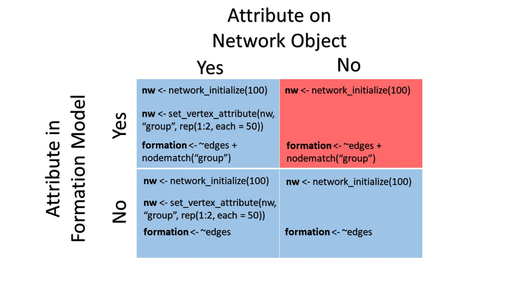
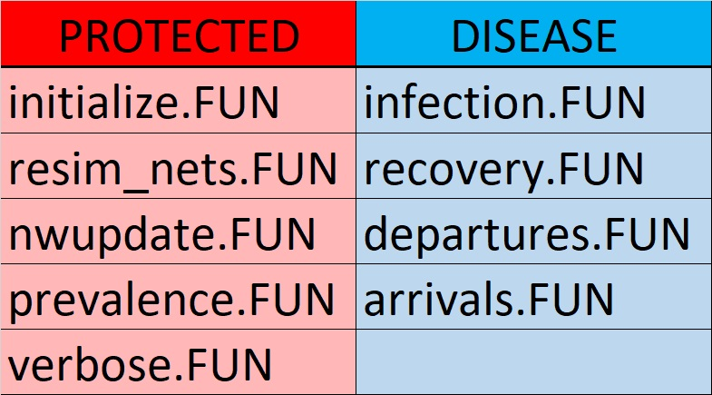

```{r echo = FALSE, eval = TRUE}
suppressMessages(suppressWarnings(library(EpiModel)))
```

# Introduction

The newest release of EpiModel, dubbed "EpiModel 2.0", brings with it several changes to the EpiModel workflow you may be accustomed to from previous version of EpiModel, as well as adding new functionality to the platform in order to make running dynamic infectious disease models even easier. In this tutorial, we will go through the major changes to EpiModel, detail the new features that have been added and in the final sections provide examples on how to migrate your code from EpiModel 1.x to EpiModel 2.0.

Throughout this document, `R` code blocks have been commeneted with the relevant EpiModel version to aid users: `# EpiModel 1.x` refers to code used in previous versions of EpiModel and `# EpiModel 2.0` refers to code from the current version of EpiModel. Uncommented code remains unchanged between versions of EpiModel.

As always information on EpiModel may be found using `help(package = "EpiModel")` or visiting [EpiModel on Github](https://github.com/statnet/EpiModel).

# EpiModel Changes

In this section, we will detail the core functions that remain in EpiModel 2.0 yet received an overhaul for efficiency, flexibility and/or user accessibility. All changes listed in this section will be further demonstrated in the "EpiModel 1.x Code Migration" section of this document.

## Rethinking Networks

The most significant change in EpiModel 2.0 is in how we approach defining, estimating and using networks in epidemic simulations as well as the resultant changes in the EpiModel workflow. The most significant change to the EpiModel workflow is in how we handle heterogeneous sub-populations. In the original EpiModel workflow, designation of a second population was done by initializing a new network and setting it's `bipartite` input parameter equal to the number of vertices in the first mode:

```{r echo = TRUE, eval = FALSE}
# EpiModel 1.x
num1 <- num2 <- 50
nw <- network.initialize(num1 + num2, directed = FALSE, bipartite = num1)
```

This creates a network in which there are 50 vertices in mode one and 50 vertices in mode two and in which inter-modal mixing does not occur, i.e., no mixing within modes. It should be noted, that this interpretation of a bipartite network is not standard. Examples of bipartite networks include health care providers and type of insurance accepted (with modes health care provider and insurance agency, with a link formed if the provider accepts this form of insurance) or business density in a city (with modes businesses and, say, zip-code and a link formed if a business resides within that area). In order to make modeling in EpiModel consistent with expected social network theory, in EpiModel 2.0 we move away from defining our networks as bipartite and instead refer to heterogeneous sub-populations as groups. This requires a change in how users set up initial networks:

```{r echo = TRUE, eval = FALSE}
# EpiModel 2.0
num1 <- num2 <- 50
nw <- network_initialize(n = num1 + num2)
nw <- set_vertex_attribute(nw, "group", rep(1:2, c(num1, num2)))
```

Above we have the updated syntax for creating bipartite, now called "two-group", networks within the EpiModel workflow. The network is initialized as usual using `network_initialize` (a new version of `network.initialize` detailed in section "Network Initialization Functions"), however, in order to capture the previous bipartite structure, we set heterogeneity as a vertex attribute instead of a network feature using `set_vertex_initialize` (a new version of `set.vertex.attribute`); in the case of the new EpiModel workflow, this is done using the attribute `group`. This change allows for consistency in interpretation as well as flexibility of network structure: in the bipartite networks we have developed using EpiModel 1.x, mixing between the two modes is not allowed. However, in a two-group network, as group assignment is now a vertex attribute, we can model within group mixing. For example, in a population of males and females, this new workflow allows us to model more than just heterosexual relationships as below:

```{r echo = TRUE, eval = FALSE}
# EpiModel 2.0
num1 <- num2 <- 50
nw <- network_initialize(n = num1 + num2)
nw <- set_vertex_attribute(nw, "group", rep(1:2, c(num1, num2)))
formation <- ~edges + nodematch("group")
target.stats <- c(30, 2)
```

In this network we have a total of 30 edges in the population, two of which involve individuals of the same sex. We can replicate the traditional bipartite behavior of default network setups by setting the target statistic for total number of within group edges to 0:

```{r echo = TRUE, eval = FALSE}
target.stats <- c(30, 0)
```

It is important to note, that the vertex attribute "group" now takes on a special meaning within the context of EpiModel modeling, separate from other attribute names. Users should be mindful when constructing networks in which "group" is a vertex attribute and note whether or not the interpretation of group aligns with that detailed above.

Further, the group vertex attribute is restricted to levels of 1 and 2; other combinations of attribute levels - say, 0 and 1 or "male" and "female" - are not permitted here and may result in EpiModel producing unintended results. Finally, we are not limited to replicating bipartite networks and the target statistic for `nodematch("group")` can be any number from 0 to the total number of edges in the network.

The above restrictions on the group vertex attribute must be taken into account or EpiModel may behave in unpredictable or unexpected ways.

### Attribute Copying

In line with the above change, we have introduced new helper functions `copy_nwattr_to_datattr` and `copy_datattr_to_nwattr` to streamline copying of attributes between the network and master dat objects. In the new EpiModel 2.0 workflow, any attribute present on the network at time of epidemic simulation is copied to the dat object as a tracked attribute. Similarly, in the course of epidemic simulation, the network object is updated with the current attribute lists. This updating is done automatically with a new function - `nwupdate.net` - that handles all interaction with the network object (explained in more detail in "Network Update" in section "EpiModel Additions & New Features") during the simulation process.

Users should be mindful of the relationship between the network object and formation model used during network estimation. The below table details the scenarios (with example code) in which attributes may or may not be on the network object and formation models: allowed scenarios are in blue, with those in red invalid for estimation.

<center>

</center>

As shown above, if an attribute (in this case "group") is on the network and both present and absent in the formation model, a valid network can be estimated; if an attribute is missing from both the network and the formation model, a valid network will still result. If, however, an attribute is not present on the network and not in the formation model, this will not lead to a valid network as we can not estimate edge formation with attributes not present in the networks attribute list.

## Base Function Changes

Along with the change to how we build two-group networks, we have also changed the built in EpiModel functions to make the workflow clearer (particularly for module development on the part of the user). In EpiModel 1.x, no distinction in module functionality was made for bipartite and non-bipartite networks. With EpiModel 2.0, we have split each of the appropriate core modules into one and two-group sub-functions. Assignment of the correction function is done automatically by EpiModel based on the based on the input parameters passed through to `init.net` or `param.net`, if `control.net` input parameter `type` is specified (see next section).  

Input parameters for each of these two functions, for the second group, have also changed with EpiModel moving from mode to group language. Second group parameters or initial conditions are now denoted by a `.g2` suffix as opposed to the `.m2` suffix that was used previously:

```{r echo = TRUE, eval = TRUE}
# EpiModel 2.0
init <- init.net(i.num = 10, i.num.g2 = 10)
param <- param.net(inf.prob = 0.1, inf.prob.g2 = 0.2)
```

Further, the default ordering of EpiModel has been changed with the update to EpiModel 2.0. EpiModel 1.x workflow processed each of the modules in the order as: departures (`departures.FUN`), arrivals (`arrivals.FUN`), recovery (`recovery.FUN`), network re-simulation (`resim_nets.FUN`), infection (`infection.FUN`) and prevalence updates (`prevelance.FUN`). EpiModel 2.0 has been updated to: network re-simulation, infection, recovery, departures, arrivals and prevalence updates (with their associated functions). As usual, default ordering of EpiModel functions can be changed using the `morder` input parameter that is passed through to `control.net`.

Below we present a table classifying each of the built in modules according to two types: protected and disease. Protected functions are those functions that have defaults set within `control.net` and are typically not meant to be interacted with by the user. Those modules of class disease are set by EpiModel based on epidemic type, and input parameters from `param.net` and `init.net` that the users specifies.

<center>
{ width=50% }
</center>

## Epidemic Type and Module Extensions

EpiModel has been set up to assist new users in their modeling efforts, while being flexible enough to allow for complex simulation scenarios not handled by base EpiModel modules. If a user passes in an epidemic type through the `control.net` input parameter `type` (e.g., `type = SI`, `SIR` or `SIS`) EpiModel will run the model as specified, using input parameters to automate the selection of appropriate base modules. If however, the user does not pass in a specified epidemic type or the three listed, or passes in `type = NULL` to control settings, then EpiModel will run the model as specified by the user; this includes running any non-standard base modules or additional user created modules in their workflow (examples of which are provided in the "Worked Example" section of this document). Conversely, if a user passes any non-standard base modules or module extensions, the epidemic type is required to be `NULL`. EpiModel will otherwise return an error if these rules are not followed. This change was made to emphasize to more advanced users of EpiModel (e.g., in the development module extensions) that EpiModel will run the model as specified, though the results may not be as expected.

Note: for two-group models, if `type` is `NULL`, the user must be mindful to select the correct version of built in modules as described in Two-Group Functions above.

## Arrivals & Departures

A further change made to the EpiModel workflow, one that was implemented in EpiModel 1.70 yet bears repeating, was moving away from the language of "births" and "deaths" in models with vital dynamics, to "arrivals" and "departures" to account for a wider range of models in which entry into and exiting from the population is not necessarily through a mortality process (e.g. entry and exit through an age process). To this end, all input parameters based on births and deaths have been renamed based on arrivals and departures. For example the birth rate `b.rate` passed to `param.net`, has been renamed `a.rate` for "arrival rate." The rate for deaths remains named `d.rate` though its interpretation has changed to that of departures. Module functions based on birth and death rates have been changed: `births.FUN` and it's associated base module `births.net` are now `arrivals.FUN` and `arrivals.net` (`arrivals.2g.net` in the two group case) respectively. Similar changes exists for `deaths.FUN` and `deaths.net`, which are now `departures.FUN` and `departures.net` respectively.

# EpiModel Additions & New Features

Along with the changes to EpiModel detailed in the previous section, several additions have been made to EpiModel and the EpiModel workflow to improve usability and clarify the overall epidemic process simulated by EpiModel.

## tergmLite

The package `tergmLite` has been added as a dependent package for EpiModel. `tergmLite` reduces the overall computational burden that comes with using the full network object in EpiModel simulations. For users whose research needs require only summary epidemiological statistics `tergmLite` gives significant computational efficiency, with simulation times sped up between 25 to 50 fold depending on the model in question. Details of `tergmLite`, as well as examples of what types of research projects it may be useful for, can be found on Github at [tergmLite](https://github.com/statnet/tergmLite).

The use of `tergmLite` is fairly straightforward and uses one of two versions of the full network object during network simulations. If `tergmLite = TRUE` is passed in as a control setting, EpiModel will use the `networkLite` version of the full network, a two-column edgelist representation of the full network. Alternatively, if `tergmLite = FALSE` is passed through, EpiModel will use the original `network` object for resimulations. As an example:

```{r echo = TRUE, eval = FALSE}
# EpiModel 2.0
nw <- network_initialize(100)
formation <- ~edges
target.stats <- 30
coef.diss <- dissolution_coefs(dissolution = ~offset(edges), duration = 25)
est <- netest(nw, formation, target.stats, coef.diss)

init <- init.net(i.num = 5)
param <- param.net(inf.prob = 0.1)

## tergmLite = FALSE: use full network object
control <- control.net(type = "SI", nsteps = 100, nsims = 1, tergmLite = FALSE)
sim1 <- netsim(est, param, init, control)

## tergmLite = TRUE: use reduced cross-sectional edgelist
control <- control.net(type = "SI", nsteps = 100, nsims = 1, tergmLite = TRUE)
sim2 <- netsim(est, param, init, control)
```

By default, the use of `tergmLite` is set to `FALSE` for EpiModel simulations.

### Saving network and transmission matrix

In parallel with the introduction of `tergmLite` as a dependent package for EpiModel, we have updated the output that is saved during simulations. When `tergmLite = FALSE` is passed in as a `control.net`setting, at simulation conclusion the network and transmission matrix are saved to the statistics sub-list of the resultant netsim object. Alternatively, if `termLite = TRUE` is input, these objects are not saved. As the use of tergmLite is off by default, these two objects are themselves saved as default.

## Network Update

Prior to EpiModel 2.0, the base functions of EpiModel were built using functions both from `EpiModel` and `network` packages. This intermingling of functions made it difficult for the end user to tease out where network functionality ended and EpiModel began, hampering understanding of the EpiModel workflow and the ability to build module extensions. In order to make the distinction between the two packages explicit and to make the purely EpiModel workflow clearer, a new base function, `nwupdate.net` has been introduced. This function pulls all interactions with the network object from base functions into `nwupdate.net` and is run at the end of the simulation. By segmenting the EpiModel workflow in this way, base EpiModel modules are now easier to navigate and make clear the output needed for module extensions.

Note: `nwupdate.net` is a function, like the base initialization function `initialize.net`, that is not meant to be interacted with or changed in most modeling cases. Similarly, as `nwupdate.net` is now handling operations done on network (when `tergmLite` is set to `FALSE`) and networkLite (when `tergmLite` is set to `TRUE`) objects, the user only needs to concern themselves with the core EpiModel disease modules, whether using base EpiModel or designing extension modules.

## Network Initialization Functions

New `tergmLite` versions of `network.initialize`, `get.vertex.attribute` and `set.vertex.attribute` have been updated for use with EpiModel as `network_initialize`, `get_vertex_attribute` and `set_vertex_attribute`. The default values of each of these functions have been set to run with EpiModel models.

## Accessor Functions

To standardize the methods for reading and writing to the `dat` object, several accessor functions have been added to EpiModel that make it clear the indexing and assignment operations that are being done on the master `dat` object during simulation, which means moving away from the `$` and `[[ ]]` operators. These functions belong to the `get` and `set` family of functions and act on the various lists contained within the master `dat` object, including but not limited to the attribute, epi, control and param lists. These functions take as input, at minimum, the master `dat` object and the item (as a character string) to "get" or "set" ("age" or "group" in the attribute list or "inf.prob" in the parameter list for example). Note that these functions and their usage only apply to module extension, where the users is either modifying existing modules or creating their own; they are not meant to be used outside of this setting.

### Set Functions

The `set` group of functions sets the value of an item on a sub-list of the `dat` object; these functions are often used at the end of a modules sequence to update attributes or for tracking of epidemic statistics. As an example: 

```{r echo = TRUE, eval = FALSE}
# EpiModel 2.0
## Code snippet from one-Group infection module:
dat <- set_epi(dat, "si.flow", at, nInf)
```

Here, we want to record the number of new infected - `nInf` -  at the current time step `at`. We do so using the `set_epi` accessor function and record the flow of susceptible to infected on to the master `dat` object. All set functions follow this naming scheme, with "set_" followed by the sub-list of interest. Note: the set functions returns an updated `dat` object.

### Get Functions

The `get` group of functions retrieve the value of an item on a sub-list of the `dat` objects, and are most often used when retrieving input parameters of `init`, `param` and `control` objects or for querying current attribute or epidemic tracker lists. As an example:

```{r echo = TRUE, eval = FALSE}
# EpiModel 2.0
## Code snippet from One-Group arrivals module
a.rate <- get_param(dat, "a.rate")
nOld <- get_epi(dat, "num", index)
```

Here we are pulling the arrival rate, `a.rate` from the parameter list and querying the epidemic tracker list for the population size at the previous step. Note that the set functions do not modify `dat` in place but return an altered dat object that must be assigned back for the changes to be saved: `dat <- set_attr(dat, "status")` as an example.

Details of all available accessor functions can be found using:

```{r echo = TRUE, eval = FALSE}
help("dat_get_set", "EpiModel")
```

# EpiModel 1.x Code Migration

The following section will help EpiModel users update code written in EpiModel 1.x.

## network_initialize replaces network.initialize

New `tergmLite` version of network initialization function:

```{r, echo = TRUE, eval = FALSE}
# EpiModel 1.x
nw <- network.initialize(num = 100, directed = FALSE)
```

should be updated to:

```{r, echo = TRUE, eval = FALSE}
# EpiModel 2.0
nw <- network_initialize(num = 100)
```

Similarly, `set.vertex.attribute` and `get.vertex.attribute` have been updated as well:
```{r echo = TRUE, eval = FALSE}
# EpiModel 1.x
nw <- set.vertex.attribute(nw, "group", rep(1:2, 50))
group <- get.vertex.attribute(nw, "group")
```

should be updated to:

```{r echo = TRUE, eval = FALSE}
# EpiModel 2.0
nw <- set_vertex_attribute(nw, "group", rep(1:2, 50))
group <- get_vertex_attribute(nw, "group")
```


## Two-Group Network Setup

The construction of bipartite networks for use in EpiModel:

```{r echo = TRUE, eval = FALSE}
# EpiModel 1.x
num1 <- num2 <- 50
nw <- network.initialize(num = num1+num2, bipartite = num1, directed = FALSE)
formation <- ~edges
target.stats <- 30
```

should be updated to two-group network models with "group" as a vertex attribute and no within-group mixing:

```{r echo = TRUE, eval = FALSE}
# EpiModel 2.0
num1 <- num2 <- 50
nw <- network_initialize(num = num1 + num2)
nw <- set_vertex_attribute(nw, "group", rep(1:2, c(num1, num2)))
formation <- ~edges + nodematch("group")
target.stats <- c(30, 0)
```

## Mode to Group Parameters

Mode syntax has been updated to group syntax where appropriate. The following:

```{r echo = TRUE, eval = FALSE}
# EpiModel 1.x
init <- init.net(i.num = 50, i.num.m2 = 50)
param <- param.net(inf.prob = 0.1, inf.prob.m2 = 0.1,
                   rec.rate = 0.02, rec.rate.m2 = 0.02,
                   act.rate = 5)
```

should be updated to:

```{r echo = TRUE, eval = FALSE}
# EpiModel 2.0
init <- init.net(i.num = 50, i.num.g2 = 50)
param <- param.net(inf.prob = 0.1, inf.prob.g2 = 0.1,
                   rec.rate = 0.02, rec.rate.g2 = 0.02,
                   act.rate = 5)
```

## User-defined Functions

When the user provides any user-defined functions, or passes in non-standard functions to base modules:

```{r echo = TRUE, eval = FALSE}
# EpiModel 2.0
## Example schema of non-standard infection.FUN to replace build in infection.net
infect2 <- function(dat, at) {
## 1. Pull in parameters relevant to infection process process. E.g.,
# Exposure rate
e.rate <- get_param(dat, "e.rate")
## 2. Pull current attribute list identifying succeptible and infectious 
## individuals. E.g.,
status <- get_attr(dat, "status")
## 3. Run infection process
## 4. Update newly exposed
status[newExp] <- "e"
dat <- set_attr(dat, "status")
##5. Return updated dat object
return(dat)
}

## Example schema of user-defined function: aging
aging <- function(dat, at) {
## 1. Pull current age
age <- get_attr(dat, "attr")
## 2. Advance age attribute by one time step
age <- age + 1
## 3. Set updated age attribute on dat object
dat <- set_attr(dat, "age")
## 4. Return updated dat object
return(dat)
}
```

```{r echo = TRUE, eval = FALSE}
# EpiModel 1.x
control <- control.net(type = SI, nsims = 10, nsteps = 10,
                       infection.FUN = infect2, aging.FUN = aging)
```

the `control.net` input parameter `type` must be `NULL`, updating code as follows:

```{r echo = TRUE, eval = FALSE}
# EpiModel 2.0
control <- control.net(type = NULL, nsims = 10, nsteps = 10,
                       resim_net.FUN = resim_nets, infection.FUN = infect2, aging.FUN = aging)
```

As mentioned previously, this change was done in order to emphasize to the user that this is a non-standard modeling type that is not handled by base EpiModel and may lead to unexpected results.

## Network Resimulation at Each Time Step

To make clear the role that the network re-simulation parameter plays, the `control.net` parameter used to resimulate the network at each time has been renamed from `depend`:

```{r echo = TRUE, eval = FALSE}
# EpiModel 1.x
control <- control.net(type = "SI", nsims = 10, nsteps = 10, depend = TRUE)
```

to `resimulate.network`:

```{r echo = TRUE, eval = FALSE}
# EpiModel 2.0
control <- control.net(type = "SI", nsims = 10, nsteps = 10, resimulate.network = TRUE)
```

## Using Accessor Functions in Module Extension 

The new accessor functions are easy-to-use utilities for getting, setting, and appending data, replacing `$`  and `[[ ]]` operations. Base EpiModel functions have already been updated reflecting this change. The following examples detail how users should update any changes to base EpiModel functions or any user-defined functions. For a robust example of how EpiModel 1.x code needs to be updated when using these functions in module extension, refer to "User-Defined Modules: SEIR Epidemic Model" in the "Worked Examples" section. Below are example code chunks from extension API:

```{r echo = TRUE, eval = FALSE}
# EpiModel 1.x
newAge <- sample(15:65, 100, replace = TRUE)
dat$attr$age <- age
```

or 

```{r echo = TRUE, eval = FALSE}
# EpiModel 1.x
newAge <- sample(15:65, 100, replace = TRUE)
dat[["attr"]][["age"]] <- age
```

should be updated to:

```{r echo = TRUE, eval = FALSE}
# EpiModel 2.0
newAge <- sample(15:65, 100, replace = TRUE)
dat <- set_attr(dat, "age", age)
```

Similarly for retrieval and setting of list elements:

```{r echo = TRUE, eval = FALSE}
# EpiModel 1.x
age <- dat$attr$age
```

or 

```{r echo = TRUE, eval = FALSE}
# EpiModel 1.x
age <- dat[["attr"]][["age"]]
```

should be updated to:

```{r echo = TRUE, eval = FALSE}
# EpiModel 2.0
age <- get_attr(dat, "age")
```

And

```{r echo = TRUE, eval = FALSE}
# EpiModel 1.x
newAge <- sample(15:65, 2, replace = TRUE)
dat$attr$age[101:102] <- newAge
```

or 

```{r echo = TRUE, eval = FALSE}
# EpiModel 1.x
newAge <- sample(15:65, 2, replace = TRUE)
dat[["attr"]][["age"]][101:102] <- newAge
```

should be updated to:

```{r echo = TRUE, eval = FALSE}
# EpiModel 2.0
newAge <- sample(15:65, 2, replace = TRUE)
dat <- append_attr(dat, "age", newAge, 2)
```

See `help("dat_get_set", "EpiModel")` for the complete list of accessor functions and their use.

# Worked Examples

The following section presents three worked examples of models built in EpiModel 1.x and the corresponding changes needed in EpiModel 2.0. Changes will be highlighted by comments. Link to full R scripts may be found by clicking the appropriate link.

## SI Model With No Vital Dynamics

Here we have a simple SI (susceptible to infected) epidemic model on a bipartite network, with [complete R script found here](https://github.com/statnet/EpiModel/tree/master/inst/2020-05-SITwoGroup). As we have moved away from bipartite networks to two-group networks, we need to first update our old network formation code. The old bipartite syntax:

```{r echo = TRUE, eval = FALSE}
## EpiModel 1.x Workflow
num1 <- num2 <- 500
nw <- network.initialize(n = num1 + num2, directed = FALSE, bipartite = num1)
formation <- ~edges
target.stats <- 400
```

need to be updated to the two-group syntax, noting that to replicate the bipartite structure of the old network, we need to set the `nodematch("group")` terms target statistic to 0 (though this statistic can range from anywhere from 0 to the total number of edges in the network).

```{r echo = TRUE, eval = FALSE}
## EpiModel 2.0 
num1 <- num2 <- 500

## update to new initialization function network_initialize.
nw <- network_initialize(n = num1 + num2)

##Update to new vertex assignment function set_vertex_attribute
nw <- set_vertex_attribute(nw, "group", rep(1:2, c(num1,num2)))

## If looking to replicate 'bipartite' network:
formation <- ~edges + nodematch("group")
target.stats <- c(400, 0)

## If interested in within group mixing; here 100 of the total edges match on group:
target.stats <- c(400, 100)
```

Next we find the coefficient of dissolution and then estimate our network.

```{r echo = TRUE, eval = FALSE}
coef.diss <- dissolution_coefs(dissolution = ~offset(edges), duration = 20)
est <- netest(nw, formation, target.stats, coef.diss)
```

Similar to moving network formation from bipartite to two-group, we need to update input parameters for initial conditions and epidemic parameters from mode (".m2" suffixes):

```{r echo = TRUE, eval = FALSE}
## EpiModel 1.x
param <- param.net(inf.prob = 0.4, inf.prob.m2 = 0.2)
init <- init.net(i.num = 20, i.num.m2 = 20)
```

to group (".g2" suffixes)

```{r echo = TRUE, eval = FALSE}
## EpiModel 2.0 Workflow
# Update all parameters and initial conditions from ".m2" to ".g2" language.
param <- param.net(inf.prob = 0.4, inf.prob.g2 = 0.2)
init <- init.net(i.num = 20, i.num.g2 = 20)
```

Finally, control parameters `depend` and `save.network` (along with `save.transmat`) have been replaced. The control parameter `resimulate.network` has replaced `depend` when a user wishes to resimulate the network at each timestep of simulation; this is to make it clearer what the parameter is actually doing. The parameters `save.network` and `save.transmat` have been replaced with `tergmLite`: if a user wishes to save the network and transmission matrix, they must use the full estimation routine provided by `tergm` (`tergmLite == FALSE`); otherwise, `tergmLite` is used, and no network of transmission matrix is saved. Thus

```{r echo = TRUE, eval = FALSE}
## EpiModel 1.x Workflow
control <- control.net(type = "SI", nsteps = 100, depend = TRUE, 
                       save.network = TRUE)
```

should be updated to:

```{r echo = TRUE, eval = FALSE}
## EpiModel 2.0
# control.net parameter depend updated to resimulate.network; save.network folded
# into tergmLite.
control <- control.net(type = "SI", nsteps = 100, resimulate.network = TRUE,
                       tergmLite = FALSE)
```

Model simulation proceeds as usual.

```{r echo = TRUE, eval = FALSE}
sim <- netsim(est, param, init, control)
```

## SIR Model With Vital Dynamics

Here we have an SIR model (recovery from infection that grants immunity) in an open population, with a one-group network on top, [complete R script located here](https://github.com/statnet/EpiModel/tree/master/inst/2020-05-SIRwithVitalDynamics). As we are dealing with a one-group network, network formation is fairly straightforward with only a change needed to the function initializing the network. Thus

```{r echo = TRUE, eval = FALSE}
## EpiModel 1.x
num <- 1000
nw <- network.initialize(num, directed = FALSE)
```

should be updated to:

```{r echo = TRUE, eval = FALSE}
## EpiModel 2.0
num <- 1000
nw <- network_initialize(num)
```

The function `network_initialize` has several defaults, one of which is `directed = FALSE`, and requires only the total size of the network in most applications. Subsequent estimation of the network proceeds as normal.

```{r echo = TRUE, eval = FALSE}
formation <- ~edges
target.stats <- 400
coef.diss <- dissolution_coefs(dissolution = ~offset(edges), duration = 20, d.rate = 0.005)
est <- netest(nw, formation, target.stats, coef.diss)
```

In EpiModel 1.70, the language of "births" and "deaths" was updated to "arrivals" and "departures." Epidemic input parameter "b.rate"

```{r echo = TRUE, eval = FALSE}
## EpiModel 1.x
param <- param.net(inf.prob = 0.4, act.rate = 1, rec.rate = 0.02,
                   b.rate = 0.005, di.rate = 0.005, ds.rate = 0.005,
                   dr.rate = 0.005)
```

should be updated to "a.rate":
```{r echo = TRUE, eval = FALSE}
## EpiModel 2.0
param <- param.net(inf.prob = 0.4, act.rate = 1, rec.rate = 0.02,
                   a.rate = 0.005, di.rate = 0.005, ds.rate = 0.005,
                   dr.rate = 0.005)
```

The input parameters for departures do not need to be updated however users should be aware of the change in interpretation. As with the previous SI example, control settings for `depend` and `save.network` (and `save.transmat`) should be updated to `resimulate.network` and `tergmLite` respectively.

```{r echo = TRUE, eval = FALSE}
## EpiModel 1.x
init <- init.net(i.num = 30)
control <- control.net(type = "SIR", nsteps = 100, depend = FALSE, 
                       save.network = FALSE)
```

```{r echo = TRUE, eval = FALSE}
## EpiModel 2.0
init <- init.net(i.num = 30)
control <- control.net(type = "SIR", nsteps = 100, resimulate.network = FALSE,
                       tergmLite = TRUE)
```

Modeling continues as normal.

```{r echo = TRUE, eval = FALSE}
sim <- netsim(est, param, init, control)
```

## User Defined Modules: SEIR Epidemic Model

Our final example, [R script found here](https://github.com/statnet/EpiModel/tree/master/inst/2020-05-SEIRModuleExtension), is an extension of the SIR model not represented in base EpiModel: an SEIR-epidemic that introduces an exposed state to the epidemic process, necessitating an updated infection module and a new disease progression module. Below, we have the new infection module that is based on EpiModel 1.x syntax.

```{r echo = TRUE, eval = FALSE}
## EpiModel 1.x
## Modified infection module
infect <- function(dat, at) {
  
  active <- dat$attr$active
  status <- dat$attr$status
  nw <- dat$nw
  
  idsInf <- which(active == 1 & status == "i")
  nActive <- sum(active == 1)
  
  nElig <- length(idsInf)
  nInf <- 0
  
  if (nElig > 0 && nElig < nActive) {
    del <- discord_edgelist(dat, at)
    if (!(is.null(del))) {
      del$transProb <- dat$param$inf.prob
      del$actRate <- dat$param$act.rate
      del$finalProb <- 1 - (1 - del$transProb)^del$actRate
      transmit <- rbinom(nrow(del), 1, del$finalProb)
      del <- del[which(transmit == 1), ]
      idsNewInf <- unique(del$sus)
      nInf <- length(idsNewInf)
      if (nInf > 0) {
        dat$attr$status[idsNewInf] <- "e"
        dat$attr$infTime[idsNewInf] <- at
      }
    }
  }
  
  if (at == 2) {
    dat$epi$se.flow <- c(0, nInf)
  } else {
    dat$epi$se.flow[at] <- nInf
  }
  dat$nw <- nw
  return(dat)
}
```

The `$` operations must all be updated with their respective accessor functions.

```{r echo = TRUE, eval = FALSE}
## EpiModel 2.0
# Update `$` operations to accessor functions
## Modified infection module
infect2 <- function(dat, at) {
  
  active <- get_attr(dat, "active")
  status <- get_attr(dat, "status")
  infTime <- get_attr(dat, "infTime")
  inf.prob <- get_param(dat, "inf.prob")
  act.rate <- get_param(dat, "act.rate")
  
  idsInf <- which(active == 1 & status == "i")
  nActive <- sum(active == 1)
  
  nElig <- length(idsInf)
  nInf <- 0
  
  if (nElig > 0 && nElig < nActive) {
    del <- discord_edgelist(dat, at)
    if (!(is.null(del))) {
      del$finalProb <- 1 - (1 - del$transProb)^del$actRate
      transmit <- rbinom(nrow(del), 1, del$finalProb)
      del <- del[which(transmit == 1), ]
      idsNewInf <- unique(del$sus)
      nInf <- length(idsNewInf)
      if (nInf > 0) {
        status[idsNewInf] <- "e"
        infTime[idsNewInf] <- at
        dat <- set_attr(dat, "status", status)
        dat <- set_attr(dat, "infTime", infTime)
      }
    }
  }
  
  dat <- set_epi(dat, "se.flow", at, nInf)
  
  return(dat)
}
```

Next, we have the disease progression module, which moves individuals from the exposed to infected state. As with the previous infection function we must update all `$` operations:
```{r echo = TRUE, eval = FALSE}
## EpiModel 1.x
## New disease progression module
progress <- function(dat, at) {
  
  active <- dat$attr$active
  status <- dat$attr$status
  
  ei.rate <- dat$param$ei.rate
  ir.rate <- dat$param$ir.rate
  
  ## E to I progression
  nInf <- 0
  idsEligInf <- which(active == 1 & status == "e")
  nEligInf <- length(idsEligInf)
  
  if (nEligInf > 0) {
    vecInf <- which(rbinom(nEligInf, 1, ei.rate) == 1)
    if (length(vecInf) > 0) {
      idsInf <- idsEligInf[vecInf]
      nInf <- length(idsInf)
      status[idsInf] <- "i"
    }
  }
  
  ## I to R progression
  nRec <- 0
  idsEligRec <- which(active == 1 & status == "i")
  nEligRec <- length(idsEligRec)
  
  if (nEligRec > 0) {
    vecRec <- which(rbinom(nEligRec, 1, ir.rate) == 1)
    if (length(vecRec) > 0) {
      idsRec <- idsEligRec[vecRec]
      nRec <- length(idsRec)
      status[idsRec] <- "r"
    }
  }
  
  dat$attr$status <- status
  
  if (at == 2) {
    dat$epi$ei.flow <- c(0, nInf)
    dat$epi$ir.flow <- c(0, nRec)
    dat$epi$e.num <- c(0, sum(active == 1 & status == "e"))
    dat$epi$r.num <- c(0, sum(active == 1 & status == "r"))
  } else {
    dat$epi$ei.flow[at] <- nInf
    dat$epi$ir.flow[at] <- nRec
    dat$epi$e.num[at] <- sum(active == 1 & status == "e")
    dat$epi$r.num[at] <- sum(active == 1 & status == "r")
  }
  
  return(dat)
}
```

with their respective accessor versions.

```{r echo = TRUE, eval = FALSE}
## EpiModel 2.0
# Update `$` operations to accessor functions
## New disease progression module
progress2 <- function(dat, at) {
  
  active <- get_attr(dat, "active")
  status <- get_attr(dat, "status")
  
  ei.rate <- get_param(dat, "ei.rate")
  ir.rate <- get_param(dat, "ir.rate")
  
  ## E to I progression
  nInf <- 0
  idsEligInf <- which(active == 1 & status == "e")
  nEligInf <- length(idsEligInf)
  
  if (nEligInf > 0) {
    vecInf <- which(rbinom(nEligInf, 1, ei.rate) == 1)
    if (length(vecInf) > 0) {
      idsInf <- idsEligInf[vecInf]
      nInf <- length(idsInf)
      status[idsInf] <- "i"
    }
  }
  
  ## I to R progression
  nRec <- 0
  idsEligRec <- which(active == 1 & status == "i")
  nEligRec <- length(idsEligRec)
  
  if (nEligRec > 0) {
    vecRec <- which(rbinom(nEligRec, 1, ir.rate) == 1)
    if (length(vecRec) > 0) {
      idsRec <- idsEligRec[vecRec]
      nRec <- length(idsRec)
      status[idsRec] <- "r"
    }
  }
  
  dat <- set_attr(dat, "status", status)
  
  dat <- set_epi(dat, "ei.flow", at, nInf)
  dat <- set_epi(dat, "ir.flow", at, nRec)
  dat <- set_epi(dat, "e.num", at, sum(active == 1 & status == "e"))
  dat <- set_epi(dat, "r.num", at, sum(active == 1 & status == "r"))
  
  return(dat)
}
```

As previously noted, `network.initialize` has been updated to `network_initialize`. Network estimation proceeds as usual.
```{r echo = TRUE, eval = FALSE}
## EpiModel 1.x
nw <- network.initialize(n = 500, directed = FALSE)
est <- netest(nw, formation = ~edges, target.stats = 150,
              coef.diss = dissolution_coefs(~offset(edges), 10))
```

```{r echo = TRUE, eval = FALSE}
## EpiModel 2.0
nw <- network_initialize(n = 500)
est <- netest(nw, formation = ~ edges, target.stats = 150,
              coef.diss = dissolution_coefs(~offset(edges), 10))
```

As usual epidemic and initial condition parameters are set.

```{r echo = TRUE, eval = FALSE}
param <- param.net(inf.prob = 0.5, act.rate = 2, ei.rate = 0.01, ir.rate = 0.005)
init <- init.net(i.num = 10)
```

In the EpiModel 1.x workflow, the user passes their updated base module (`infect`) and new epidemic module (`progress`) through to `control.net` for use in their epidemic simulation.
```{r echo = TRUE, eval = FALSE}
## EpiModel 1.x
## Epidemic model parameterization
control <- control.net(nsteps = 100, nsims = 1, infection.FUN = infect,
                       progress.FUN = progress, recovery.FUN = NULL)
```

In EpiModel 2.0, if any base modules have been changed or any user defined modules are present the user must specify their epidemic type as NULL, even if the module potentially follows an acceptable base epidemic type (SI, SIR or SIS). Further, the user must specify all base epidemic modules, even if these modules are not used within the epidemic process. This change has been made in order to make clear the difference between base EpiModel use (in which most of the modeling setup is automated) and more advanced EpiModel use (including module extension). The above code written in EpiModel 1.x should then be updated to:

```{r echo = TRUE, eval = FALSE}
## EpiModel 2.0
## Epidemic model parameterization
# If any user defined functions, type must equal NULL
control <- control.net(type = NULL, nsteps = 100, nsims = 1, infection.FUN = infect,
                       progress.FUN = progress)
```
