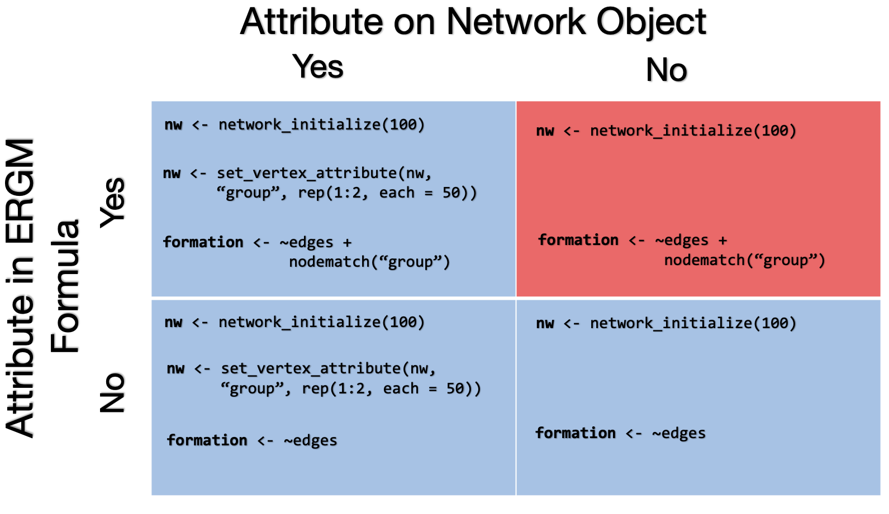
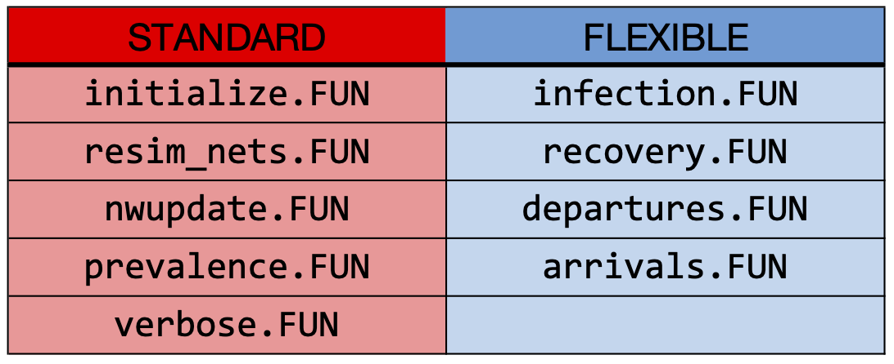

```{r echo = FALSE, eval = TRUE}
suppressMessages(suppressWarnings(library(EpiModel)))
```

# Introduction
The current major release of EpiModel, `EpiModel 2.0`, incorporates several substantial changes to the core EpiModel workflow compared to previous version of EpiModel. These changes were to add new functionality to EpiModel, streamlining dynamic infectious disease models. This tutorial document reviews the major changes to EpiModel, details the new features that have been added, and provides examples migration of code from EpiModel 1.x to EpiModel 2.0.

Throughout this document, `R` code blocks have been commented with the relevant EpiModel version: `## EpiModel 1.x` refers to code used in previous versions of EpiModel and `## EpiModel 2.0` refers to code from the current version of EpiModel. Uncommented code remains unchanged between versions of EpiModel. Note that all of these substantial changes were made to the network class of models, which is the core innovative modeling class in EpiModel.

Broader information on EpiModel may be found by visiting [EpiModel on Github](https://github.com/statnet/EpiModel).

# EpiModel Changes
In this section, we detail the core functionality that remains in EpiModel 2.0 but that were revised for efficiency, flexibility, and user accessibility. Changes in this section will be further demonstrated in the "EpiModel 1.x Code Migration" section below.

## Heterogenous Epidemic Models
In EpiModel 1.x, the built-in network models featured both one-mode and two-mode default parameterizations. The two-model parameterization allowed for easy modeling of heterogeneous populations in which there were epidemic parameters specific to a subgroup. One significant change to the EpiModel workflow is in how we handle heterogeneous subpopulations in the built-in (core) epidemic models for networks. In the EpiModel 1.x workflow, designation of a subpopulation was done by initializing a new network and setting its `bipartite` input parameter equal to the number of vertices in the first mode:

```{r eval = FALSE}
## EpiModel 1.x
num1 <- num2 <- 50
nw <- network.initialize(num1 + num2, directed = FALSE, bipartite = num1)
```

This creates a network in which there are 50 vertices in mode one and 50 vertices in mode two. By defining this as a bipartite network, no mixing within modes occurs. A prime example of bipartite networks is modeling purely heterosexual networks, in which the modes correspond to sexes and there is only mixing across that attribute. Bipartite networks are more often defined as nodes in each mode being of distinct classes. Examples include persons (in mode 1) and places (in mode 2); persons may be linked to places but places cannot be linked to places. 

However, the built-in models are framed as one-mode networks (one class of persons), even with certain mixing constraints. Therefore, in EpiModel 2.0 we move away from defining our networks as bipartite and instead refer to heterogeneous sub-populations as groups. This requires a change in networks are parameterized, with nodal attributes now.

```{r eval = FALSE}
## EpiModel 2.0
num1 <- num2 <- 50
nw <- network_initialize(n = num1 + num2)
nw <- set_vertex_attribute(nw, "group", rep(1:2, c(num1, num2)))
```

Above is the updated syntax for creating "two-group" networks within the EpiModel 2.0 workflow. The network is initialized as usual using `network_initialize` (a new EpiModel-specific version of `network.initialize` detailed in section "Network Initialization Functions" below). Then to capture the previous dissortative mixing structure, we create a vertex attribute, `group`, using `set_vertex_initialize` (a new EpiModel-specific version of `set.vertex.attribute`).

This change allows for consistency in interpretation of nodes as well as greater flexibility of network model parameterization. In a two-group network defined above, with group assignment handled with a vertex attribute, it is now possible to model a continuum of mixing conditions, from purely dissortative (mirroring bipartite networks) to random mixing to purely assortative mixing. For example, in a heterosexual mixing model in a population of males and females, this new workflow allows us to model dissortative mixing with a `nodematch` term within the ERGM formula with an associated target statistic of 0:

```{r eval = FALSE}
## EpiModel 2.0
num1 <- num2 <- 50
nw <- network_initialize(n = num1 + num2)
nw <- set_vertex_attribute(nw, "group", rep(1:2, c(num1, num2)))
formation <- ~edges + nodematch("group")
target.stats <- c(30, 0)
```

We could also change the parameterization such that some same-sex relationships are possible, but fewer than expected by chance alone:

```{r eval = FALSE}
target.stats <- c(30, 3)
```

The vertex attribute `group` now takes on a special class within built-in EpiModel models. Users should be mindful when constructing networks in which `group` is a vertex attribute and note whether or not the interpretation of "group" membership aligns with that detailed above. Further, the `group` vertex attribute is restricted to levels of 1 and 2; other combinations of attribute levels -- say, 0 and 1 or "male" and "female" -- are not permitted here and may result in unintended results.

With two-group network models specified in this way, one can feed in group-specific epidemic parameters and initial conditions. For example, here are these inputs for a two-group SIR model in an open population (in which there are births and deaths):

```{r eval = FALSE}
param <- param.net(inf.prob = 0.3, inf.prob.g2 = 0.15,
                   rec.rate = 0.02, rec.rate.g2 = 0.02,
                   a.rate = 0.002, a.rate.g2 = NA,
                   ds.rate = 0.001, ds.rate.g2 = 0.001,
                   di.rate = 0.001, di.rate.g2 = 0.001,
                   dr.rate = 0.001, dr.rate.g2 = 0.001)
init <- init.net(i.num = 10, i.num.g2 = 10,
                 r.num = 0, r.num.g2 = 0)
```

The parameters and initial conditions that pertain to the second group (those with a group attribute value of 2), correspond with the arguments ending with `.g2`. 

Note that these two-group network models with the group attribute were possible before, in EpiModel 1.x, it is just that now the group attribute in the network object has a specific and special meaning when running the epidemic models with `netsim`. For clarity, we have limited these to two groups within the built-in models, but the functionality may be easily extended with the network model extensions (described at the bottom of this document and in other tutorials).

The group attribute may be on the network object and that attribute may also be referenced within an ERGM formation model. This approach would be used when one wants to have a two-group epidemic model (with group-specific epidemic model parameters) and also a network structure that incorporates heterogeneity in activity or mixing by group. But one may also have an epidemic model in which the group attribute is on the network object but not in the ERGM formation model. This would be used in the case when one wants to have group-specific epidemic model parameters but no network structure specific to groups.

<center>
 
</center>

The above table details the scenarios (with example code) in which attributes may or may not be on the network object and formation models: allowed scenarios are in blue, with those in red invalid for estimation.

### Attribute Copying
Given the change above, we have also introduced new helper functions, `copy_nwattr_to_datattr` and `copy_datattr_to_nwattr`, to streamline copying of attributes between the network and the epidemic data storage object, `dat`, that is handled by `netsim`. In the new EpiModel 2.0 workflow, any attribute present on the network at time of epidemic simulation is copied to the `dat` object as a tracked attribute. Similarly, in the course of epidemic simulation, the network object is updated with the current attribute lists. This updating is done automatically with a new function -- `nwupdate.net` -- that handles all modification of the network object (explained in the "Network Update" section below) during the epidemic simulation process. These changes are most relevant to use cases involving extension of the modules, and not for the built-in models. 


## Base Module Changes
Along with the change to how we build two-group networks, we have also changed the built in EpiModel functions to make the workflow clearer (particularly for module development). With EpiModel 2.0, we have split each of the appropriate core epidemic modules into one and two-group functions. Assignment of the appropriate function is done automatically by EpiModel based on the input parameters passed through to `init.net` or `param.net`.  

Further, the default ordering of how the modules are executed within `netsim` has been changed. EpiModel 1.x workflow processed each of the modules in the order as: departures (`departures.FUN`), arrivals (`arrivals.FUN`), recovery (`recovery.FUN`), network resimulation (`resim_nets.FUN`), infection (`infection.FUN`) and prevalence updates (`prevelance.FUN`). With EpiModel 2.0, this has been updated to: network resimulation, infection, recovery, departures, arrivals, network updates, and prevalence updates. The network updates (`nwupdate.FUN`) module is new, and consolidates all modifications to the network object (this is further detailed below). The default ordering of EpiModel functions can be changed using the module order control setting, `morder`, passed to `control.net`.

The table below presents a classification of the built-in modules according to two types: standard and flexible. Standard modules (in red) are typically not meant to be modified by the user in most applied extension cases. Those modules of class flexible (in blue) are often modified based on novel research cases and are typically related to diease modeling. For built-in models, the protected modules have hard-coded default functions in `control.net`, while the flexible modules have no hard-coded default functions because the appropriate function is selected based on the input parameters from `param.net` and initial conditions in `init.net`.

<center>
{ width=75% }
</center>

## Epidemic Type
EpiModel has been built to teach new users how to run models, while also providing flexibility to allow for advanced users to build complex model extensions not handled by the built-in EpiModel models. If a user passes in an epidemic type through the `control.net` control setting `type` (e.g., `type = SI`, `SIR` or `SIS`), EpiModel will run the model as specified, using input parameters to automate the selection of appropriate module functions. 

If the user does not specify an epidemic type, or specifies `type = NULL`, then EpiModel will run the set of modules explicitly specified by the user; this includes running any non-standard base modules or additional user created modules in their workflow (examples are provided in the "Full Examples" section below). Conversely, if a user passes any non-standard modules, the epidemic type must be `NULL`. EpiModel will otherwise return an error if these rules are not followed. This change was made to emphasize to more advanced users of EpiModel (e.g., building module extensions) that EpiModel will run the specific set of modules specified in the control settings. .

Note: for two-group models, if `type` is `NULL`, the user must be mindful to select the correct version of built-in modules as described in two-group functions above.

## Arrivals & Departures
One update implemented in EpiModel 1.70, but which bears repeating, was to move away from the language of "births" and "deaths" in models with vital dynamics to "arrivals" and "departures". This accounts for a wider range of models in which entry into and exiting from the population is not necessarily through a births or mortality processes. To this end, all input parameters based on births and deaths have been renamed based on arrivals and departures. For example the birth rate `b.rate` passed to `param.net` has been renamed `a.rate` for "arrival rate." The rate for deaths remains named `d.rate` though its interpretation has changed to that of departures. Module functions based on birth and death rates have been changed: `births.FUN` and its associated base module `births.net` are now `arrivals.FUN` and `arrivals.net` (`arrivals.2g.net` in the two group case) respectively. Similar changes exists for `deaths.FUN` and `deaths.net`, which are now `departures.FUN` and `departures.net` respectively.

### Extending Arrivals & Departures
Users looking to extend the base `arrivals.FUN` and/or `departures.FUN` modules, are now required to have the following attributes tracked within their model: `active` (a list of active nodes within the network, set to `1` for active and `0` for inactive), `entrTime` (the entry time of a node into the network) and `exitTime` (the exit time of a node from the network). These attributes are set initially within `initialize.net`, however changes to these attributes must now be updated within the appropriate module. For an example on how this is done, see the code base of `arrivals.net` and `departures.net`

```{r echo = TRUE, eval = FALSE}
## Full code base for arrivals.net:
arrivals.net()

## Full code base for departures.net:
departures.net()
```

# EpiModel New Features
Along with the changes to EpiModel, several new features have been added to EpiModel to improve usability and clarify the epidemic simulation workflow.

## tergmLite
The package `tergmLite` has been added as a dependent package for EpiModel. `tergmLite` reduces the overall computational burden that comes with using the full network class objects in EpiModel simulations. For users whose research needs require only summary epidemiological statistics, `tergmLite` provides significant computational efficiency, with simulation time improvements of 25- to 50-fold. Details of `tergmLite`, as well as examples of what types of research projects it may be useful for, can be found on [Github at tergmLite](https://github.com/statnet/tergmLite).

`tergmLite` uses a sparse data representation of network objects during epidemic model simulations. If `tergmLite = TRUE` is passed as a control setting, EpiModel will use the `networkLite` version of the full network, a two-column edgelist representation of the full network. Alternatively, if `tergmLite = FALSE` is passed through, EpiModel will use the full `network` object for resimulations. Everything happens "under the hood" for building and modifying the appropriate network class object. Here is a simple example with different tergmLite options specified.

```{r echo = TRUE, eval = FALSE}
## EpiModel 2.0
nw <- network_initialize(100)
formation <- ~edges
target.stats <- 30
coef.diss <- dissolution_coefs(dissolution = ~offset(edges), duration = 25)
est <- netest(nw, formation, target.stats, coef.diss)

init <- init.net(i.num = 5)
param <- param.net(inf.prob = 0.1)

## tergmLite = FALSE: use full network object
control1 <- control.net(type = "SI", nsteps = 100, nsims = 1, tergmLite = FALSE)
sim1 <- netsim(est, param, init, control1)

## tergmLite = TRUE: use reduced cross-sectional edgelist
control2 <- control.net(type = "SI", nsteps = 100, nsims = 1, tergmLite = TRUE)
sim2 <- netsim(est, param, init, control2)
```

By default, the use of `tergmLite` is set to `FALSE` for EpiModel simulations.

### Saving Network Data
In parallel with the introduction of `tergmLite` methods, we have consolidated the control settings for specifying the output that is saved during simulations. When `tergmLite = FALSE` is passed in as a `control.net`setting, at simulation conclusion the full network object and transmission matrix (line list of transmission events each time step) are saved to the statistics sub-list of the resultant netsim object. Alternatively, if `termLite = TRUE` is input, these objects are not saved. As `tergmLite = FALSE` by default, these two objects are saved by default.

### Removal of delete.nodes
In EpiModel 1.x, the control parameter `delete.nodes` was used to truncate the cross-sectional representation of the full network (without individual level history of nodes and edges). This was intended to save computational time, however, in most cases this reduction did not occur. `delete.nodes` has thus been removed, and - as stated above - the full network object is retained when the `tergmLite` input parameter is `FALSE`.

## Network Update
Prior to EpiModel 2.0, the modules within `netsim` in EpiModel were built using functions both from `EpiModel` and `network` packages. In order to make the distinction between the two packages explicit and to make the EpiModel workflow clearer, a new base model for all modifications of the network object, `nwupdate.FUN`, has been introduced. This module consolidates all interactions (reading and writing) with the network object from base functions into a separate function, `nwupdate.net`.

The `nwupdate.net` function is a module that is in the protected class, meaning that it is intended to be modified by the end user in most modeling cases. As `nwupdate.net` now handles operations done on network (when `tergmLite` is set to `FALSE`) and networkLite (when `tergmLite` is set to `TRUE`) objects, the end user only needs to be concerned   with the core disease modules.

## Network Initialization Functions
New `tergmLite` versions of `network.initialize`, `get.vertex.attribute`, and `set.vertex.attribute` have been updated for use with EpiModel as `network_initialize`, `get_vertex_attribute` and `set_vertex_attribute`. The default values of each of these functions have been explicitly set to run with EpiModel models. 

## Accessor Functions
To standardize the methods for reading and writing to the `dat` object, several accessor functions have been added to EpiModel that make it clear the indexing and assignment operations that are being done on the master `dat` object during simulation, which means moving away from the `$` and `[[ ]]` operators. These functions belong to the `get` and `set` family of functions. They act on the sublists contained within the master `dat` object, including but not limited to the attribute, `epi`, `control`, and `param` lists. These functions take as input, at minimum, the master `dat` object and the item (as a character string) to "get" or "set" ("age" or "group" in the attribute list or "inf.prob" in the parameter list for example).

Note that these functions and their usage only apply to EpiModel module extension, where users are modifying existing modules or creating their own; they are not meant to be used outside of this setting. The reason for their use is to standardize the methods for interacting with the core `dat` data object. 

### Set Functions
The `set` functions set the value of an item on a sublist of the `dat` object; these functions are often used at the end of a modules sequence to update attributes or for tracking of epidemic statistics. As an example, the following case would update the `si.flow` epi summary statistic, with a value of `nInf` new infections at the time step `at`. 

```{r echo = TRUE, eval = FALSE}
## EpiModel 2.0

## Code snippet from infection module:
dat <- set_epi(dat, "si.flow", at, nInf)
```

All set functions follow this naming scheme, with `set_` followed by the sub-list of interest. Note: that the `set` functions do not modify `dat` in place but return an altered `dat` object that must be assigned back for the changes to be saved, `dat <- set_attr(dat, "status", new_status)` as an example.

### Get Functions
The `get` group of functions retrieve the value of an item on a sublist of the `dat` objects, and are most often used when retrieving input parameters of `init`, `param`, and `control` objects or for querying current attribute or epidemic tracker lists. As an example, this extracts the arrival rate, `a.rate`, from the parameter list and extracts the current population size, `num`, from the epi summary statistics at the previous time step.

```{r echo = TRUE, eval = FALSE}
## EpiModel 2.0

## Code snippet from one-group arrivals module:
a.rate <- get_param(dat, "a.rate")
nOld <- get_epi(dat, "num", at - 1)
```

Further details of all the available accessor functions can be found using the help function:

```{r echo = TRUE, eval = FALSE}
help("dat_get_set", "EpiModel")
```


# EpiModel 1.x Migration

The following section will help EpiModel users update code written in EpiModel 1.x (all versions of EpiModel 1.0 to 1.8.0, the final version before EpiModel 2.0).

## Network Initialization
The network initialization function:
```{r, echo = TRUE, eval = FALSE}
## EpiModel 1.x
nw <- network.initialize(num = 100, directed = FALSE)
```

should be updated to:
```{r, echo = TRUE, eval = FALSE}
## EpiModel 2.0
nw <- network_initialize(num = 100)
```

The new `network_initialize` has the undirected networks set as the default, so no longer a need to explicitly specify `directed = FALSE`. 

Similarly, `set.vertex.attribute` and `get.vertex.attribute`:
```{r echo = TRUE, eval = FALSE}
## EpiModel 1.x
nw <- set.vertex.attribute(nw, "group", rep(1:2, 50))
group <- get.vertex.attribute(nw, "group")
```

should be updated to their new corresponding EpiModel functions:
```{r echo = TRUE, eval = FALSE}
## EpiModel 2.0
nw <- set_vertex_attribute(nw, "group", rep(1:2, 50))
group <- get_vertex_attribute(nw, "group")
```

**This update applies to both built-in and extension models.**

## Two-Group Network Setup
The construction of built-in heterogeneous networks in EpiModel used to rely on structural bipartite networks:
```{r echo = TRUE, eval = FALSE}
## EpiModel 1.x
num1 <- num2 <- 50
nw <- network.initialize(num = num1 + num2, bipartite = num1, directed = FALSE)
formation <- ~edges
target.stats <- 30
```

These should now be updated to two-group network models with "group" as a vertex attribute and no within-group mixing:
```{r echo = TRUE, eval = FALSE}
## EpiModel 2.0
num1 <- num2 <- 50
nw <- network_initialize(num = num1 + num2)
nw <- set_vertex_attribute(nw, "group", rep(1:2, c(num1, num2)))
formation <- ~edges + nodematch("group")
target.stats <- c(30, 0)
```

Note also that it is now possible to have a continuum of mixing levels by specifying different values for the target statistic corresponding to the `nodematch` term. 

**This update applies to both built-in and extension models.**

## Update to Prevalence Function
The function querying of current state or compartment sizes during simulation has been renamed from`get_prev.net` to `prevalance.net`. Control settings, passed through `control.net`, should be updated as such:

```{r echo = TRUE, eval = FALSE}
## EpiModel 1.x
control <- control.net(get_prev.FUN = get_prev.net)
```

```{r echo = TRUE, eval = FALSE}
## EpiModel 2.0
control <- control.net(prevalence.FUN = prevalence.net)
```

**This update applies to both built-in and extension models.**

## Group-Specific Parameters
Within the initial conditions and epidemic parameters, mode-specific parameters (ending with `.m2`) should be replaced with group-specific parameters (ending with `.g2`). For example, the following:

```{r echo = TRUE, eval = FALSE}
## EpiModel 1.x
init <- init.net(i.num = 50, i.num.m2 = 50)
param <- param.net(inf.prob = 0.1, inf.prob.m2 = 0.1,
                   rec.rate = 0.02, rec.rate.m2 = 0.02,
                   act.rate = 5)
```

should be updated to:
```{r echo = TRUE, eval = FALSE}
## EpiModel 2.0
init <- init.net(i.num = 50, i.num.g2 = 50)
param <- param.net(inf.prob = 0.1, inf.prob.g2 = 0.1,
                   rec.rate = 0.02, rec.rate.g2 = 0.02,
                   act.rate = 5)
```

**This update applies to both built-in and extension models.**

## Epidemic Type Specification
When the user provides any user-defined functions, or passes in non-standard functions to base modules, as in the following schematics for infection or aging modules:

```{r echo = TRUE, eval = FALSE}
## EpiModel 2.0

## Example schematic of non-standard infection.FUN to replace built in infection.net
infect2 <- function(dat, at) {
  ## 1. Pull in parameters relevant to infection process process. E.g.,
  # Exposure rate
  e.rate <- get_param(dat, "e.rate")
  ## 2. Pull current attribute list identifying succeptible and infectious 
  ## individuals. E.g.,
  status <- get_attr(dat, "status")
  ## 3. Run infection process
  ## 4. Update newly exposed
  status[newExp] <- "e"
  dat <- set_attr(dat, "status")
  ##5. Return updated dat object
  return(dat)
}

## Example schematic of user-defined function: aging
aging <- function(dat, at) {
  ## 1. Pull current age
  age <- get_attr(dat, "attr")
  ## 2. Advance age attribute by one time step
  age <- age + 1
  ## 3. Set updated age attribute on dat object
  dat <- set_attr(dat, "age")
  ## 4. Return updated dat object
  return(dat)
}
```

the control setting `type` used to be allowed to be set to one of the three built-in model types and EpiModel would guess which other modules would be needed. 
```{r echo = TRUE, eval = FALSE}
## EpiModel 1.x
control <- control.net(type = "SI", nsims = 10, nsteps = 10,
                       infection.FUN = infect2, aging.FUN = aging)
```

Now, any time any non-standard modules are defined (as in the aging module) or any non-standard functions corresponding to existing modules are passed (as in the infection module), the `control.net` input parameter `type` must be `NULL`, updating code as follows:
```{r echo = TRUE, eval = FALSE}
## EpiModel 2.0
control <- control.net(type = NULL, nsims = 10, nsteps = 10,
                       resim_net.FUN = resim_nets, infection.FUN = infect2, aging.FUN = aging)
```

As mentioned previously, this change was done in order to emphasize to the user that this is a non-standard model type that is not handled by base EpiModel and may lead to unexpected results.

**This update only applies to extension models.**

## Network Resimulation
To clarify when network resimulation within `netsim` occurs, the `control.net` parameter used to resimulate the network at each time has been renamed from `depend`:
```{r echo = TRUE, eval = FALSE}
## EpiModel 1.x
control <- control.net(type = "SI", nsims = 10, nsteps = 10, depend = TRUE)
```

to `resimulate.network`:
```{r echo = TRUE, eval = FALSE}
## EpiModel 2.0
control <- control.net(type = "SI", nsims = 10, nsteps = 10, resimulate.network = TRUE)
```

`resimulate.network` must be set in control settings by the user if that functionality is desired; as a default, `resimulate.network` is set to `FALSE`.

**This update applies to both built-in and extension models.**

## Using Accessor Functions
The new accessor functions provide utilities for getting, setting, and appending data, replacing `$`  and `[[ ]]` operations. Base EpiModel functions have already been updated reflecting this change. The following examples detail how users should update any changes to base EpiModel functions or any user-defined functions. For a robust example of how EpiModel 1.x code needs to be updated when using these functions in module extension, refer to "User-Defined Modules: SEIR Epidemic Model" in the "Full Examples" section. Below are example code chunks from extension API:
```{r echo = TRUE, eval = FALSE}
## EpiModel 1.x
newAge <- sample(15:65, 100, replace = TRUE)
dat$attr$age <- age
```

or 
```{r echo = TRUE, eval = FALSE}
## EpiModel 1.x
newAge <- sample(15:65, 100, replace = TRUE)
dat[["attr"]][["age"]] <- age
```

should be updated to:
```{r echo = TRUE, eval = FALSE}
## EpiModel 2.0
newAge <- sample(15:65, 100, replace = TRUE)
dat <- set_attr(dat, "age", age)
```

Similarly for retrieval and setting of list elements:
```{r echo = TRUE, eval = FALSE}
## EpiModel 1.x
age <- dat$attr$age
```

or 
```{r echo = TRUE, eval = FALSE}
## EpiModel 1.x
age <- dat[["attr"]][["age"]]
```

should be updated to:
```{r echo = TRUE, eval = FALSE}
## EpiModel 2.0
age <- get_attr(dat, "age")
```

In the case where we are updating or adding new values to the attribute list:
```{r echo = TRUE, eval = FALSE}
## EpiModel 1.x
# Append two new values to age list
newAge <- sample(15:65, 2, replace = TRUE)
dat$attr$age[101:102] <- newAge
```

or 
```{r echo = TRUE, eval = FALSE}
## EpiModel 1.x
# Append two new values to age list
newAge <- sample(15:65, 2, replace = TRUE)
dat[["attr"]][["age"]][101:102] <- newAge
```

should be updated to:
```{r echo = TRUE, eval = FALSE}
## EpiModel 2.0
# Append two new values to age list
newAge <- sample(15:65, 2, replace = TRUE)
dat <- append_attr(dat, "age", newAge, 2)
```

See `help("dat_get_set", "EpiModel")` for the complete list of accessor functions and their use.

**This update only applies to extension models.**

## Syntax in Extenstion Models with Population Dynamics
With the update to EpiModel 2.0, and introduction of new helper modules (specifically `nwupdate.net`), we have implemented [ ]. In extension models with population dynamics (i.e. arrivals and departures from the population) it is necessary to include three individual level attributes within your workflow:
* `active`: an attribute indicating whether an individual is active within the population.
* `entrTime`: an attribute that indicates time of entry into the population.
* `exitTime`: an attribute that indicates time of exit from the population.

These two attributes should be created at initialization (see `initialize.net()` or below for a coding example) and updated in their associated modules: `arrivals.FUN` (for `active` and `entrTime`) and `departures.FUN` (for `active` and `exitTime`). These three attributes are used in the helper function `nwupdate.net` and are now required for the use of EpiModel when population dynamics are present.

As an example (sample code for initialization and arrival modules):

```{r echo = TRUE, eval = FALSE}
my_initialize <- function() {
  # Standard attributes
  num <- network.size(nw)
  dat <- set_attr(dat, "active", rep(1, num), override.length.check = TRUE)
  dat <- set_attr(dat, "entrTime", rep(1, num))
  dat <- set_attr(dat, "exitTime", rep(NA, num))
  
}
```

```{r echo = TRUE, eval = FALSE}
# Given total new arrivals equal to nArrivals, update attributes
my_arrivals <- function() {
  dat <- append_attr(dat, "active", 1, nArrivals)
  dat <- append_attr(dat, "entrTime", at, nArrivals)
  dat <- append_attr(dat, "exitTime", NA, nArrivals)
}
```


**This update only applies to extension models.**

# Full Examples
The following section presents three fully worked examples of models built in EpiModel 1.x and the corresponding changes needed in EpiModel 2.0. Changes will be highlighted by comments. Link to full R scripts may be found by clicking the appropriate link.

## SI Model With No Vital Dynamics
Here we have a simple SI (susceptible to infected) epidemic model on a bipartite network [[R SCRIPT](SITwoGroup.R)]. As we have moved away from bipartite networks to two-group networks, we need to first update our old network formation code. The old bipartite syntax:
```{r echo = TRUE, eval = FALSE}
## EpiModel 1.x Workflow
num1 <- num2 <- 500
nw <- network.initialize(n = num1 + num2, directed = FALSE, bipartite = num1)
formation <- ~edges
target.stats <- 400
```

should be updated to the two-group syntax, noting that to replicate the bipartite structure of the old network, we need to set the `nodematch("group")` terms target statistic to 0 (though this statistic can range from anywhere from 0 to the edges statistic).
```{r echo = TRUE, eval = FALSE}
## EpiModel 2.0 
num1 <- num2 <- 500

## Update to new initialization function network_initialize.
nw <- network_initialize(n = num1 + num2)

## Update to new vertex assignment function set_vertex_attribute
nw <- set_vertex_attribute(nw, "group", rep(1:2, c(num1, num2)))

## If looking to replicate 'bipartite' network:
formation <- ~edges + nodematch("group")
target.stats <- c(400, 0)

## If interested in within group mixing; here 100 of the total edges match on group:
target.stats <- c(400, 100)
```

Next we find the coefficient of dissolution and then estimate our network.
```{r echo = TRUE, eval = FALSE}
coef.diss <- dissolution_coefs(dissolution = ~offset(edges), duration = 20)
est <- netest(nw, formation, target.stats, coef.diss)
```

Similar to moving network formation from bipartite to two-group, we need to update input parameters for initial conditions and epidemic parameters from mode (`.m2` suffixes):
```{r echo = TRUE, eval = FALSE}
## EpiModel 1.x
param <- param.net(inf.prob = 0.4, inf.prob.m2 = 0.2)
init <- init.net(i.num = 20, i.num.m2 = 20)
```

to group (`.g2` suffixes)
```{r echo = TRUE, eval = FALSE}
## EpiModel 2.0:
# Update all parameters and initial conditions from ".m2" to ".g2" language.
param <- param.net(inf.prob = 0.4, inf.prob.g2 = 0.2)
init <- init.net(i.num = 20, i.num.g2 = 20)
```

Finally, control parameters `depend` and `save.network` (along with `save.transmat`) have been replaced. The control parameter `resimulate.network` has replaced `depend` when a user wishes to resimulate the network at each timestep of simulation; this is to make it clearer what the parameter is actually doing. The parameters `save.network` and `save.transmat` have been replaced with `tergmLite`: if a user wishes to save the network and transmission matrix, they must use the full simulation approach provided by `tergm` (`tergmLite == FALSE`); otherwise, `tergmLite` is used, and no network of transmission matrix is saved. Thus:
```{r echo = TRUE, eval = FALSE}
## EpiModel 1.x
control <- control.net(type = "SI", nsteps = 100, depend = FALSE, 
                       save.network = TRUE)
```

should be updated to the following, where the network object is always saved if the tergmLite is not used.
```{r echo = TRUE, eval = FALSE}
## EpiModel 2.0:
# control.net parameter depend updated to resimulate.network; save.network folded into tergmLite.
control <- control.net(type = "SI", nsteps = 100, resimulate.network = FALSE,
                       tergmLite = FALSE)
```

Model simulation proceeds as usual with `netsim`.
```{r echo = TRUE, eval = FALSE}
sim <- netsim(est, param, init, control)
```

## SIR Model With Vital Dynamics
Here we have an SIR model (recovery from infection that confers immunity) in an open population, with a one-group network on top [[R SCRIPT](SIRwithVitalDynamics.R)]. As we are using a one-group network, network formation is fairly straightforward with only a change needed to the function initializing the network. Thus: 
```{r echo = TRUE, eval = FALSE}
## EpiModel 1.x
num <- 1000
nw <- network.initialize(num, directed = FALSE)
```

should be updated to:
```{r echo = TRUE, eval = FALSE}
## EpiModel 2.0
num <- 1000
nw <- network_initialize(num)
```

The function `network_initialize` has several default parameter values, one of which is `directed = FALSE`, and requires only the total size of the network in most applications. Subsequent estimation of the network proceeds as before.
```{r echo = TRUE, eval = FALSE}
formation <- ~edges
target.stats <- 400
coef.diss <- dissolution_coefs(dissolution = ~offset(edges), duration = 20, d.rate = 0.005)
est <- netest(nw, formation, target.stats, coef.diss)
```

In EpiModel 1.7.0 onward, the language of "births" and "deaths" was updated to "arrivals" and "departures." Epidemic input parameter "b.rate". 
```{r echo = TRUE, eval = FALSE}
## EpiModel 1.x
param <- param.net(inf.prob = 0.4, act.rate = 1, rec.rate = 0.02,
                   b.rate = 0.005, di.rate = 0.005, ds.rate = 0.005,
                   dr.rate = 0.005)
```

should be updated to "a.rate":
```{r echo = TRUE, eval = FALSE}
## EpiModel 2.0
param <- param.net(inf.prob = 0.4, act.rate = 1, rec.rate = 0.02,
                   a.rate = 0.005, di.rate = 0.005, ds.rate = 0.005,
                   dr.rate = 0.005)
```

The input parameters for departures do not need to be updated. However, users should be aware of the change in syntax. As with the previous SI example, control settings for `depend` and `save.network` (and `save.transmat`) should be updated to `resimulate.network` and `tergmLite` respectively.
```{r echo = TRUE, eval = FALSE}
## EpiModel 1.x
init <- init.net(i.num = 30)
control <- control.net(type = "SIR", nsteps = 100, depend = TRUE, 
                       save.network = FALSE)
```

```{r echo = TRUE, eval = FALSE}
## EpiModel 2.0
init <- init.net(i.num = 30)
control <- control.net(type = "SIR", nsteps = 100, resimulate.network = TRUE,
                       tergmLite = TRUE)
```

Model simulation proceeds as usual with `netsim`.
```{r echo = TRUE, eval = FALSE}
sim <- netsim(est, param, init, control)
```

## SEIR Extension Model
Our final example is an extension of the SIR model not represented in base EpiModel: an SEIR epidemic that introduces an exposed latent state to the epidemic process, necessitating an updated infection module and a new disease progression module [[R SCRIPT](SEIRModuleExtension.R)]. Below, we have the new infection module based on EpiModel 1.x syntax.
```{r echo = TRUE, eval = FALSE}
## EpiModel 1.x
## Modified infection module
infect <- function(dat, at) {
  
  active <- dat$attr$active
  status <- dat$attr$status
  nw <- dat$nw
  
  idsInf <- which(active == 1 & status == "i")
  nActive <- sum(active == 1)
  
  nElig <- length(idsInf)
  nInf <- 0
  
  if (nElig > 0 && nElig < nActive) {
    del <- discord_edgelist(dat, at)
    if (!(is.null(del))) {
      del$transProb <- dat$param$inf.prob
      del$actRate <- dat$param$act.rate
      del$finalProb <- 1 - (1 - del$transProb)^del$actRate
      transmit <- rbinom(nrow(del), 1, del$finalProb)
      del <- del[which(transmit == 1), ]
      idsNewInf <- unique(del$sus)
      nInf <- length(idsNewInf)
      if (nInf > 0) {
        dat$attr$status[idsNewInf] <- "e"
        dat$attr$infTime[idsNewInf] <- at
      }
    }
  }
  
  if (at == 2) {
    dat$epi$se.flow <- c(0, nInf)
  } else {
    dat$epi$se.flow[at] <- nInf
  }
  dat$nw <- nw
  return(dat)
}
```

The `$` operations must all be updated with their respective accessor functions, and remove any modifications to the network object. Note that the accessor functions for the `set_epi` now do not require specification that they be created versus modified (as they did for the EpiModel 1.x version). Instead `set_epi` will create `se.flow` on the dat object if it does not exist, or update it with a new entry at the current time step if it does exist.
```{r echo = TRUE, eval = FALSE}
## EpiModel 2.0:
# Update `$` operations to accessor functions

## Modified infection module
infect2 <- function(dat, at) {
  
  active <- get_attr(dat, "active")
  status <- get_attr(dat, "status")
  infTime <- get_attr(dat, "infTime")
  inf.prob <- get_param(dat, "inf.prob")
  act.rate <- get_param(dat, "act.rate")
  
  idsInf <- which(active == 1 & status == "i")
  nActive <- sum(active == 1)
  
  nElig <- length(idsInf)
  nInf <- 0
  
  if (nElig > 0 && nElig < nActive) {
    del <- discord_edgelist(dat, at)
    if (!(is.null(del))) {
      del$finalProb <- 1 - (1 - del$transProb)^del$actRate
      transmit <- rbinom(nrow(del), 1, del$finalProb)
      del <- del[which(transmit == 1), ]
      idsNewInf <- unique(del$sus)
      nInf <- length(idsNewInf)
      if (nInf > 0) {
        status[idsNewInf] <- "e"
        infTime[idsNewInf] <- at
        dat <- set_attr(dat, "status", status)
        dat <- set_attr(dat, "infTime", infTime)
      }
    }
  }
  
  dat <- set_epi(dat, "se.flow", at, nInf)
  
  return(dat)
}
```

Next, we have the disease progression module, which moves individuals from the exposed to infected state. As with the previous infection function we must update all `$` operations with the new accessor functions:
```{r echo = TRUE, eval = FALSE}
## EpiModel 1.x

## New disease progression module
progress <- function(dat, at) {
  
  active <- dat$attr$active
  status <- dat$attr$status
  
  ei.rate <- dat$param$ei.rate
  ir.rate <- dat$param$ir.rate
  
  ## E to I progression
  nInf <- 0
  idsEligInf <- which(active == 1 & status == "e")
  nEligInf <- length(idsEligInf)
  
  if (nEligInf > 0) {
    vecInf <- which(rbinom(nEligInf, 1, ei.rate) == 1)
    if (length(vecInf) > 0) {
      idsInf <- idsEligInf[vecInf]
      nInf <- length(idsInf)
      status[idsInf] <- "i"
    }
  }
  
  ## I to R progression
  nRec <- 0
  idsEligRec <- which(active == 1 & status == "i")
  nEligRec <- length(idsEligRec)
  
  if (nEligRec > 0) {
    vecRec <- which(rbinom(nEligRec, 1, ir.rate) == 1)
    if (length(vecRec) > 0) {
      idsRec <- idsEligRec[vecRec]
      nRec <- length(idsRec)
      status[idsRec] <- "r"
    }
  }
  
  dat$attr$status <- status
  
  if (at == 2) {
    dat$epi$ei.flow <- c(0, nInf)
    dat$epi$ir.flow <- c(0, nRec)
    dat$epi$e.num <- c(0, sum(active == 1 & status == "e"))
    dat$epi$r.num <- c(0, sum(active == 1 & status == "r"))
  } else {
    dat$epi$ei.flow[at] <- nInf
    dat$epi$ir.flow[at] <- nRec
    dat$epi$e.num[at] <- sum(active == 1 & status == "e")
    dat$epi$r.num[at] <- sum(active == 1 & status == "r")
  }
  
  return(dat)
}
```

with their respective accessor versions. Note here the standard workflow for any module function becomes clearer: 1) pull the necessary objects from dat, modify those objects, then set the objects back on dat and/or update the objects in place. 
```{r echo = TRUE, eval = FALSE}
## EpiModel 2.0:
# Update `$` operations to accessor functions

## New disease progression module
progress2 <- function(dat, at) {
  
  active <- get_attr(dat, "active")
  status <- get_attr(dat, "status")
  
  ei.rate <- get_param(dat, "ei.rate")
  ir.rate <- get_param(dat, "ir.rate")
  
  ## E to I progression
  nInf <- 0
  idsEligInf <- which(active == 1 & status == "e")
  nEligInf <- length(idsEligInf)
  
  if (nEligInf > 0) {
    vecInf <- which(rbinom(nEligInf, 1, ei.rate) == 1)
    if (length(vecInf) > 0) {
      idsInf <- idsEligInf[vecInf]
      nInf <- length(idsInf)
      status[idsInf] <- "i"
    }
  }
  
  ## I to R progression
  nRec <- 0
  idsEligRec <- which(active == 1 & status == "i")
  nEligRec <- length(idsEligRec)
  
  if (nEligRec > 0) {
    vecRec <- which(rbinom(nEligRec, 1, ir.rate) == 1)
    if (length(vecRec) > 0) {
      idsRec <- idsEligRec[vecRec]
      nRec <- length(idsRec)
      status[idsRec] <- "r"
    }
  }
  
  dat <- set_attr(dat, "status", status)
  
  dat <- set_epi(dat, "ei.flow", at, nInf)
  dat <- set_epi(dat, "ir.flow", at, nRec)
  dat <- set_epi(dat, "e.num", at, sum(active == 1 & status == "e"))
  dat <- set_epi(dat, "r.num", at, sum(active == 1 & status == "r"))
  
  return(dat)
}
```

As previously noted, `network.initialize` has been updated to `network_initialize`. Network estimation proceeds as usual.
```{r echo = TRUE, eval = FALSE}
## EpiModel 1.x
nw <- network.initialize(n = 500, directed = FALSE)
est <- netest(nw, formation = ~edges, target.stats = 150,
              coef.diss = dissolution_coefs(~offset(edges), 10))
```

should be replaced with:
```{r echo = TRUE, eval = FALSE}
## EpiModel 2.0
nw <- network_initialize(n = 500)
est <- netest(nw, formation = ~ edges, target.stats = 150,
              coef.diss = dissolution_coefs(~offset(edges), 10))
```

As usual epidemic parameters and initial condition parameters are set.
```{r echo = TRUE, eval = FALSE}
param <- param.net(inf.prob = 0.5, act.rate = 2, ei.rate = 0.01, ir.rate = 0.005)
init <- init.net(i.num = 10)
```

In the EpiModel 1.x workflow, the user passes their updated base module (`infect`) and new epidemic module (`progress`) through to `control.net` for use in their epidemic simulation.
```{r echo = TRUE, eval = FALSE}
## EpiModel 1.x

## Epidemic model control settings
control <- control.net(nsteps = 100, nsims = 1, infection.FUN = infect,
                       progress.FUN = progress, recovery.FUN = NULL)
```

In EpiModel 2.0, if any base modules have been changed or any user defined modules are present the user must specify their epidemic type as NULL, even if the module potentially follows an acceptable base epidemic type (SI, SIR or SIS). Further, the user must specify all base epidemic modules, even if these modules are not used within the epidemic process. This change has been made in order to make clear the difference between base EpiModel use (in which most of the modeling setup is automated) and more advanced EpiModel use (including module extension). The above code written in EpiModel 1.x should then be updated to:
```{r echo = TRUE, eval = FALSE}
## EpiModel 2.0

## Epidemic model control settings
# If any user defined functions, type must be NULL
control <- control.net(type = NULL, nsteps = 100, nsims = 1, 
                       infection.FUN = infect, progress.FUN = progress)
```
